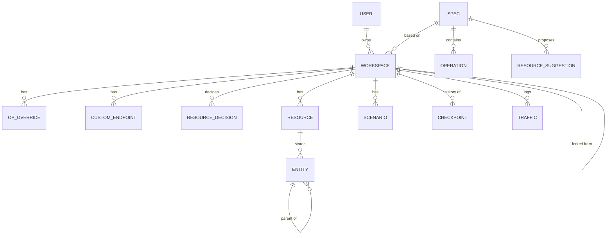
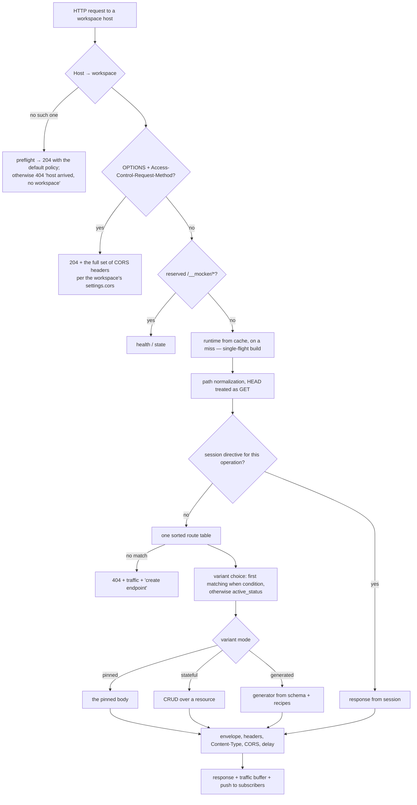

# mocker — design doc

**Status:** v12 — the document ADDS intent for the third time (§34, API
design on top of a workspace: the product as the tool a team designs an
API with, on the owner's brief of 2026-09-03 and inserted by the agent at
the owner's explicit instruction «внеси в правки Дизайн … что решили
сейчас»); v12 moved nothing in §23 and nothing in §§1–33, and §34.6 lists
what is DECIDED against what is still OPEN. v11 (§32, assets) and v10 (§30,
streaming) were the two earlier such versions. What exactly is shipped,
what is carved out and what remains — §23.
**Date:** 2026-08-16 (v3, before the first line of code) → 2026-08-25 (v4, by
what was actually built) → 2026-08-28 (v5, the resource layer) → 2026-08-29 (v6,
`data_snap` and one level of nesting) → 2026-08-30 (v7, three levels of it) →
2026-08-31 (v8, a parameterised base path) → 2026-08-31 (v9, a second generation
of suggestions) → 2026-09-01 (v10, streaming: SSE and WebSocket mocks, on an
explicit decision by the owner) → 2026-09-02 (v11, assets, on the owner's
answers to four questions) → 2026-09-03 (v12, API design, on the owner's
brief and his lifting of the no-screen rule).
**History:** v1 → review (3 lenses) → v2 → repeat review (3 lenses) → v3 →
implementation of `P0`…`P2f`, `A1`, `A2`, `A3` → v4 → `P3a`, `P3b`, `P3c` → v5 →
`P3d`, `P3e` → v6 → `P3g` → v7 → `P3h` → v8 → `P3f` → v9 → v10 → `P4a`, `A4`,
`P6a`–`P6d`, `A5` → v11 → `A6`–`A16`, `P4b`, `P6e` → v12.
The list of second-round edits — §21, of the fourth — §24, of the fifth — §25, of
the sixth — §26, of the seventh — §27, of the eighth — §28, of the ninth — §29,
of the tenth — §31, of the eleventh — §33, of the twelfth — §35.

**How to read v10.** Sections 1–22 remain a document about the DESIGN and were
edited only where the design diverged from the implementation and diverged
silently: such places are marked in the text itself. Everything built
differently than designed, and everything designed and not built, is collected
in §23 — the same place lists the four spots where the document before v4 lied
by oversight rather than by design.

**v10 is a different KIND of version and must be read as one.** Every version
from v4 to v9 brought this document up to code that already existed. v10 removes
a line from §2's non-goals and designs a subsystem of which not one line is
written — the first time since v3 that this document leads rather than follows.
It is therefore the one version whose §30 can be WRONG in the way a design is
wrong, rather than merely out of date: nothing has been measured against a
running build yet. §30.16 names the three places most likely to need a v11.

---

## 1. What this is and why we need it

An internal tool. A self-hosted mock backend driven **from the browser, live**.
You upload an OpenAPI spec — the service immediately answers every one of its
operations with meaningful data. Then in the UI you can open any endpoint, change
a field, nail down your own response, add operations the spec does not have, turn
on real CRUD with persisted state. With no restart and no code edits.

The service lives in a corporate network. A frontend developer or tester logs in,
gets a **personal workspace** and exposes their mocked backend at their own
address.

**The problem:** frontend development and testing when the real backend does not
exist, is broken, or cannot be brought into the state you need.

Comparisons with other products are deliberately absent from this document.

---

## 2. Settled decisions

| decision | choice | consequence |
|---|---|---|
| Delivery form | self-hosted docker service | need storage, workspace routing, authorization |
| Storage | SQLite (WAL) | git review of the config is lost → compensated by the bundle (§17) |
| Deployment | corporate network | internal CA, no guaranteed internet access |
| Admin UI authorization | shared password (phase 1) | no isolation between people; provider is swappable (§15) |
| Access to the mock | open to everyone in the network | the frontend is configured with one variable, no secrets in CI |
| Workspace routing | by `Host` | wildcard DNS + wildcard certificate; fallback to a path prefix |

### Rejected alternatives

A path prefix as the primary mode (breaks absolute paths, `Location`, cookie
`Path`, `Origin`); a port per workspace; a ready-made OpenAPI router
(`kin-openapi`, openapi-backend) — hostage to a strict meta-schema and cannot do
operations outside the spec; out-of-the-box generation (json-schema-faker and
friends) — no per-field recipes; full dereference (duplicates schemas, explodes
on recursion).

**Node/TypeScript on the server** was rejected in favor of Go (§16): in a closed
network a single static binary with the UI embedded is delivered by `docker
save`/`load`, whereas an image with `node_modules` requires an internal npm
registry or a vendored cache. The second argument — a synchronous SQLite driver
there would block the whole process, and that would leak into the design (see
`busy_timeout` in §13). The price of the decision is the absence of a ready
Swagger 2.0 → OpenAPI 3 converter; we write it ourselves (§7).

### Out of scope for v1

- **Proxy mode.** The target audience has no real backend at hand. There is no
  point paying for an unused feature with SSRF by construction and a branch in
  the router. The value `proxy` in `mode` stays unclaimed.
- **GraphQL and gRPC mocks.** gRPC needs HTTP/2 and protobuf descriptors,
  GraphQL needs a schema runtime and a resolver model, and neither has anything
  to do with an OpenAPI document: they are different products, not two more
  behaviours of this one. Postman and HAR import. A diff between arbitrary
  versions of a spec.
- ~~WebSocket mocks~~ — **out of scope from v1 through v9, IN scope since v10**
  (§30), on an explicit decision by the owner, 2026-09-01. The bullet above read
  "GraphQL, gRPC, WebSocket mocks" as one line, and the three were joined only by
  being absent, never by being alike. The strikethrough is deliberate: an agent
  does not edit this document, a human unblocked exactly one of the three, and
  deleting the words would delete the record of what was refused and for how
  long. **SSE mocks were never on this list at all** — they appear in no bullet
  of this section and nowhere else on it — and reading them as part of the
  WebSocket bullet is the mistake that one line invited for nine versions.

---

## 3. Domain model



- **Spec** — an imported document, immutable, shared by workspaces.
- **Operation** — the operation index. Key `(method, path)`, where **`path` is
  stored WITHOUT the base path** (§7). `operationId` is sometimes empty and
  sometimes duplicated — no good as a key, it stays a caption for human eyes.
- **Workspace** — the unit of isolation and addressing.
- **OpOverride** — an operation override, key `(workspace_id, method, path)` by
  the same relative path.
- **Scenario** — a named set of workspace settings, switchable with one click and
  from tests.
- **Checkpoint** — a history point for rollback.

---

## 4. Response layers

| layer | what | lifetime |
|---|---|---|
| **Spec** | the response schema as it is in the spec | forever, never mutated |
| **Workspace** | overrides, custom endpoints, resources, settings | in SQLite |
| **Scenario** | the active named set on top of the workspace settings | in SQLite |
| **Session** | "right now": forced status, delay, one-shot, pause, `fail_next` counters | RAM, its own TTL |

The session layer **lives outside the runtime** (§12) and survives its rebuild
and eviction. Any state that has to change on every request (counters) lives only
here and **never raises `revision`**.

**A stream fits this table without a fifth row (v10, §30.4).** A streaming
endpoint is a **Workspace**-layer object and only that: it is authored as a
custom endpoint and never derived from a spec, so the **Spec** layer has nothing
to say about it. The **Scenario** layer carries none — custom endpoints are not
part of a scenario and never will be, because the runtime keys them by row id and
a row inside a snapshot blob has no id to be keyed by — so the canonical
"everything fails" scenario cannot make a streaming endpoint fail. And the
**Session** layer applies **once, at the handshake, never per frame**: a forced
status aborts the upgrade, a pause parks it, a delay delays it, and a `fail_next`
counter is spent one unit per CONNECTION ATTEMPT, which is what makes "the third
reconnect succeeds" the thing an operator can actually observe.

---

## 5. Spec re-import

An override is addressed by the natural key `(workspace_id, method, path)` on the
relative path, and therefore survives a change of spec version. When a workspace
is moved to a new version — for each of the **three** entities:

- **op_overrides:** key matched → works; no such operation → the override is
  marked orphaned (stored, not applied, shown in a list with the actions
  "delete" / "turn into a custom endpoint"); the response schema changed and the
  override references a field that vanished → we show a diff.
- **resources:** `route_family` disappeared → the resource is marked orphaned;
  `entity_schema` diverged from the new spec → "the schema changed" + a "refresh
  schema" button (the old documents stay in `entities`; the divergence has to be
  visible, not silent).
- **custom_endpoints:** the path appeared in the spec → "it is in the spec now,
  turn it into an override?". Otherwise a custom endpoint silently shadows the
  very operation whose absence made the user create it.

`operations.id` in overrides is a nullable cache, recomputed when the spec
changes. The same relative key goes into the bundle (§17).

---

## 6. The request path



**Workspace resolution comes first.** Both preflight and `/__mocker/health` must
know which workspace is meant: the first — to apply its CORS settings, the
second — to return `{workspace, revision, spec}` and tell "the host arrived, the
workspace does not exist" apart from "it did not arrive at all". Otherwise the P0
readiness criterion checks DNS and TLS but not the routing it was created for.

**Custom endpoints have no branch of their own** — they are in the same route
table, and the precedence rules are described in §8 in one place.

---

## 7. Spec import

**Input:** OpenAPI 3.1, 3.0, Swagger 2.0. As a file, a ZIP archive or a directory
(multi-file specs with relative `$ref`), or by URL (§15).

1. **Format** from the `openapi` / `swagger` fields.
2. **Swagger 2.0 → OAS 3.0** via `swagger2openapi`.
3. **Base path.** The `paths` keys are not full paths: the full path = the path
   component of `servers[].url` + the key. `swagger2openapi` does not prefix the
   paths, it folds `host+basePath` into `servers`, so Swagger 2.0 breaks the same
   way. **`operations.path` stores the path WITHOUT the prefix.** The prefix is
   computed at import (rule below, `variables` expanded with defaults — but a
   variable a `servers[].url` uses and does NOT declare stays as the literal
   `{name}`, so an ordinary import can and does produce a base path carrying a
   parameter; `P3h` makes that a supported case rather than an accident, §23),
   put into `specs.base_path` as a hint and copied into the workspace's
   `settings.basePath`, where it can be edited. **The concatenation happens in
   exactly one place — when the runtime's routes are assembled.** That way a
   prefix edit applies instantly, orphaning no override (their key is relative)
   and not breaking bundle portability.

   **Where the prefix comes from.** The rule "the first server" is not enough: in
   the real spec P1a was accepted against there is no root `servers[]` at all —
   the arrays hang on every path item and contradict each other (97 paths →
   `http://localhost:8080` with an empty path component, 9 → `/api/v1`, 4 declare
   an empty `servers: []`). The rule is extended to:

   | `basePathOrigin` | when | prefix |
   |---|---|---|
   | `root-servers` | the root has a non-empty `servers[]` | the path component of the **first** server |
   | `path-servers` | there is no root one, but all path items with a non-empty `servers[]` yield one path component | it |
   | `ambiguous` | such path items disagree | **empty** + a warning in the report with both candidates |
   | `absent` | there is no `servers[]` anywhere | empty |

   An empty prefix under `ambiguous`/`absent` is a decision, not a stub: a prefix
   guessed from the wrong majority silently breaks **all** paths, whereas an empty
   one leaves the `paths[]` keys verbatim, and a human fixes them in
   `settings.basePath`. The origin is a field of the import report, not a column:
   it travels in the import response and in `GET /api/specs/{id}/report`, and is
   shown on the "Specs" screen (§14), so that editing the prefix is a deliberate
   act.
4. **Dialect normalization:** boolean `exclusiveMinimum/Maximum` → the numeric
   form; `example` → `examples`; `nullable: true` → an `x-nullable` marker for the
   generator **and** an honest union for the validator (a single representation is
   inadmissible here, see §9).
5. **Operation indexing** — the JSON pointer, response variants, the media type
   **for every status** (`operation_responses`). Default response selection: the
   lowest numeric 2xx → `2XX` → `default`. `2XX` and `default` are not sendable
   codes, so two fields are stored: `response_selector` (what was in the spec) and
   `http_status` (what we will actually send; for `2XX` — 200, for `default` —
   200), plus `status_origin` to show in the UI.
6. **Resource derivation** — once per spec into `resource_suggestions` (an
   immutable set, versioned on `rederive`). The workspace's decisions live
   separately (§11).
7. **Auth profile detection** (§10).

**`$ref` resolution is lazy:** a JSON-pointer resolver with memoization, a depth
budget and a set of visited pointers **per branch** — not shared across the
resolver: otherwise memoization drags already-traversed hops into someone else's
budget and the chain breaks off the earlier the more of the document was parsed
before it.

**The budget is 32 hops, not 6.** Measured on the P1a acceptance spec (130
operations): the longest `$ref` chain reachable from an operation is 12 hops, and
28 of the 130 operations do not fit into six. The caveat is honest: **P1a itself
resolves about one hop deep** (response → `components/responses`), deep chains
will be needed by the P1b generator — that is, 32 is headroom for the next phase,
not a fix for the current one. An exhausted budget and a cycle do not bring the
import down: the operation is marked unparsed and the finding travels into the
report (invariant below).

**Invariants:** the import never fails (an unparsed operation is marked and
answers with an empty 200, the report is shown on the "Specs" screen); the spec is
stored as `raw` + `normalized`; deduplication by the hash of `raw`.

---

## 8. Router

**One sorted table** for spec operations and custom endpoints, assembled when the
runtime is built (paths are concatenated with `settings.basePath`). The order:

1. more static segments — higher;
2. on a tie — a static segment to the left of a parametric one;
3. on equal specificity **the custom endpoint wins**;
4. after that — the explicit `source_order` from the DB (SQLite row order is not
   guaranteed).

**The canonical path** (`canonical_path`) is the path with parameters replaced by
`{}`. It is stored as a column and used like this:

- two **custom** endpoints with the same `canonical_path` are a conflict, the
  second one cannot be created;
- a custom endpoint canonically equal to a **spec** operation is **not a conflict
  but an override**; that is what the UI calls it. This is exactly the case
  "a hand-added `/users/{id}` shadows the spec one";
- an override and a custom endpoint on the same key at once are **forbidden** at
  the API level: otherwise the override silently has no effect.

**Path normalization:** cut off the query, collapse `//`, strip the trailing `/`,
decode `%XX` segment by segment.

**Preflight — after workspace resolution, before the route table.** A 204 answer
with the full set: `Access-Control-Allow-Origin` (reflected), `Vary: Origin`,
**`Access-Control-Allow-Methods`**, **`Access-Control-Allow-Credentials`** when
`cors.credentials`, an echo of `Access-Control-Request-Headers`, `Max-Age`.
Without `Allow-Methods` the browser fails every `PUT`/`PATCH`/`DELETE`; without
`Allow-Credentials` — every request with `credentials: 'include'`, and that is
exactly what the cookie authorization from §10 needs. On ordinary responses —
`Access-Control-Expose-Headers`. **CORS headers are set on 404 and on 500 too**,
otherwise the browser shows a CORS error instead of the real cause.

**`HEAD` matches as `GET`** with the body zeroed out.

**Request validation is optional and off by default.** A validator that is on
cuts live requests down on formalities and returns 400 where the real server
answers 200. The validators (`santhosh-tekuri/jsonschema/v6`) are compiled lazily
and only for operations with validation enabled.

**Body parsing on the mock plane:** `application/json` strictly; `text/plain` and
requests with no type — we read them as text and try `JSON.parse`, and if that
fails we leave them as text and **do not answer 400** (clients send a JSON string
with no type all the time); `multipart` we do not touch; everything else is a
buffer with a limit.
**On the admin plane the parser is strict** — a tolerant one turns a POST into a
"simple" CORS request and opens up CSRF (§15).

---

## 9. The data generator

### Determinism

**A workable formulation:** with settings unchanged, the same request yields the
same response — except for explicitly now-relative fields and stateful resources.

**The seed is computed layer by layer, not "for the whole response"** — otherwise
lists fall apart:

```
seedList    = hash64(settings.seed, method, canonicalPath, pathParams, http_status)   // WITHOUT query
seedItem(i) = hash64(seedList, i)          // i — the GLOBAL index, not the position on the page
seedScalar  = hash64(seedList, dataPath)
```

From this follows the mandatory **generated-list contract** (without it the very
first screen of an app breaks on plain P1, where there are no resources yet):

- the page length is taken from `limit` / `per_page` / `size`, the offset from
  `offset` / `page` / `cursor`; `total` — from `listSize`, the same for every
  page;
- the element with the global index `offset+i` is reproducible on any page:
  `?offset=20` returns the continuation of the same set, not twenty new people
  with the same ids;
- **`GET /{id}` of the same route family** is generated with the seed of the
  element with that id, not with its own seed: clicking a list row leads to the
  same person, not a different one;
- query parameters declared in the spec whose names match schema fields are
  applied as a post-filter (topping up generation to the requested length).

The traversal is **fully synchronous**: `faker.seed()` at the start, no `await` —
otherwise the faker instance gets interleaved between parallel requests.

**Time.** The base "now" for ordinary fields comes from the seed. Deadline fields
(`exp`, `*_expires_at`, `expires_in`, `not_after`) come from the **real** `now`: a
fixed `exp` makes the installation non-working the next day.

**Delay and forced failures are taken out from under the seed.** There is no
random error rate: an irreproducible failure is useless for a test (§12,
session).

### Value-source precedence

recipe → `example`/`examples` (media type → named → schema → `const` → `default`)
→ `enum` → generation from the schema.

### Realism

`format`, then the **field name**: `email`, `*_url`/`image`/`avatar`/`cover` →
URL, `phone`, `*_at`/`date`, `first_name`. In real specs `format` is almost never
set; without name analysis the frontend crashes on
`new URL("fugiat cupidatat")`.

### Schema composition

- **`allOf` is an intersection of constraints, not an overwrite.** `required` are
  unioned, `properties` are merged, numeric and string bounds are narrowed
  (`minimum` = max across branches, `maximum` = min), `additionalProperties:
  false` in any branch closes the result. **An unsatisfiable composition**
  (`minimum: 10` + `maximum: 5`) is not a reason to generate a number: the
  operation is marked with a schema error and that is visible in the UI.
- **`oneOf` / `anyOf`** — the branch is chosen deterministically by the hash of
  the path in the data; the result is checked by the composition validator, and on
  a miss there is a bounded retry across the other branches. For `oneOf` the
  result must satisfy **exactly one** branch. The branch is visible in the UI and
  can be pinned with a recipe.
- **`discriminator`** — the branch by `mapping`, and **the discriminator field
  itself is always set**: without it zod/io-ts rejects the whole body.
- **`readOnly` / `writeOnly`** — by direction.
- **`x-nullable`** — `null` only if `type` is exactly `["null"]`, if a recipe says
  so, if `default: null`, or at the `nullRate` fraction (default 0).

### Body, type and status

Response variants are stored per `(operation, status)` together with their own
media type (§13): 200 may be JSON while 409 is `text/plain`, and switching the
status must not send someone else's `Content-Type`. Choosing the representation is
Accept negotiation with an explicit fallback and a 406. **204/205 and `HEAD` carry
no body**, no envelope is put on them. Declared response headers are set. For
non-JSON — a placeholder by type; a pinned body may be stored in base64.

### Recipes

Addressed by a **path in the data**: `items[*].status`,
`user.profile.avatar_url`.

| kind | example | what it does |
|---|---|---|
| `const` | `"published"` | always this value |
| `enum` | `["draft","published"]` | a random one from the list (seeded) |
| `faker` | `person.fullName` | a faker call |
| `template` | `Заказ №{{index}}` (a Russian template string) | substitutions |
| `sequence` | `start: 1000, step: 1` | autoincrement across elements |
| `copy` | `$.id` | the value of a field of this same object |
| **`identity`** | `identity.id`, `identity.roles` | a field of the "logged-in" user (§10) |
| **`ref`** | `resource:42.id` | a value from the entities of another resource |
| **`jwt`** | claims + ttl | a structurally valid token (§10) |
| **`now`** | `+3600s`, `-7d`, epoch/ISO | time from the real "now" |
| `null` / `omit` | | a forced null / remove the field |
| `listSize` | `25` or `[5,50]` | array length |

**`ref` addresses a resource by `resource_id`, not by name**: names are not unique
(`/orgs/{id}/subjects` and `/admin/subjects`). The recipe filters by a compatible
scope, and the behavior with an empty source and when the target is deleted is set
by the policy `restrict` / `set-null` / `generate` (default — `generate`: generate
a value but mark it in the traffic). Without `ref`, `GET /quizzes` will return
`subject_id: 8471` while `GET /subjects` returns a list without 8471, and any
screen with linked selects will not work. Auto-suggestion: a `<singular>_id` field
when the resource `<plural>` exists.

**A schema patch** — add a field the spec does not have. Stored as a JSON Patch.
**The UI does not split "recipe versus patch"** (§14).

**Bounds:** recursion depth, array length, response size
(`MOCKER_MAX_RESPONSE`). A large `listSize` on a nested schema multiplies at every
level — we cut by the size of the result.

---

## 10. Modeling authentication

Without this section the rest is useless: the frontend logs in, the generator
returns an `access_token` like `"fugiat cupidatat"` (in the spec it is
`type: string`), `jwt-decode` throws, the app never leaves the login screen.

**`identity` in the workspace settings** — a flat dictionary: `id`, `name`,
`email`, `roles`, `org` (`{id, name, type}`), arbitrary extra keys.

**The "flow-through" mechanism is ordinary recipes, not magic.** There is a recipe
kind `identity: <field>`; the auto-preset simply **writes these recipes** into
overrides, after which they are visible, checkable and editable with the same
means as everything else. Name matching with aliases:

| response field | taken from |
|---|---|
| `id`, `user_id`, `uid`, `sub` | `identity.id` |
| `name`, `full_name`, `fullName`, `display_name` | `identity.name` |
| `email`, `login` | `identity.email` |
| `roles`, `permissions` | `identity.roles` |
| `organization_id`, `org_id`, `app_id` | `identity.org.id` |

The matching is shown in the preset **before** confirmation and can be edited.

**This extends beyond `/me`.** Organizations, roles and feature flags are part of
the same profile: if `GET /organizations` returns random roles, the frontend will
not find a suitable organization and will show an empty screen (in the reference
implementation this case had to be fixed with a separate curated override). The
preset proposes projections for the user / org / roles / config routes and a rule
for filling owner fields when entities are created and populated.

**The `jwt` recipe** — three base64url segments, a real header, claims from a
template on top of `identity`, `exp = now + ttl`, an HS256 signature with the key
`settings.auth.signingKey` (generated when the workspace is created) or
`alg: none`. The token grants no access at all — it exists so the frontend can
parse it. **The token's `sub` and the id in `/me` are taken from the same
`identity`** — otherwise a frontend that compares them goes into a login loop.

**Lifetimes are in epoch SECONDS.** Clients schedule refresh as
`setTimeout(handler, (expires_at - now) * 1000)`; milliseconds overflow the 32-bit
timer (maximum ≈24.8 days) and fire immediately → an endless refresh.

**The auto-preset** works off `securitySchemes` (`http bearer`, `oauth2`,
`openIdConnect`, `apiKey`) and the paths `/auth/*`, `/login`, `/token`,
`/refresh`, `/oauth/*`, `/userinfo`, `/me`.

**Cookies.** The mock is on a different host than the frontend, so cookie
authorization requires `SameSite=None; Secure` — it is set automatically (and
requires `Access-Control-Allow-Credentials`, §8).

**Incoming tokens are not verified.** The mock accepts any `Authorization` and its
absence: a tool that can refuse entry will one day refuse entry in the middle of
debugging. Optionally a requirement that the header exists at all can be turned
on.

**Negative login scenarios** ("wrong password → 401") are done with trigger
conditions (§12), not by switching the status by hand.

---

## 11. Stateful resources

Derivation looks for pairs `/{...}/{plural}` and `/{...}/{plural}/{param}` with
collection and element verbs; the result is an immutable `resource_suggestions` at
the spec level. **The decision is made by the workspace** (`resource_decisions`):
"reject" and `rederive` must not leak into other people's workspaces — the spec is
shared by the team and has a dozen users.

- **A resource's identity is the whole canonical route**, not the last segment:
  otherwise `/orgs/{orgId}/users` and `/admin/users` conflict, and
  `/quizzes/{id}/comments` and `/posts/{id}/comments` cannot both be created.
- **Nesting is by rows, not by definitions.** An entity has `parent_entity_id`
  with `ON DELETE CASCADE`: deleting `/orgs/1` physically takes its users with it.
  Linking only through `scope_key` is not enough — the records stay orphaned and
  resurrect when an organization with the same id is created.
- **`id_strategy`**: `seq` | `uuid` | `template`. `entity_key` is stored as
  `String(data[id_field])`, the path parameter is compared as a string.
- **The list wrapper** — we recognize `items`/`data`/`results` + `total`/`count`.

**The listing contract:** the default order is `ORDER BY entities.id` (without an
explicit order the pages will overlap); query parameters declared in the spec that
match entity fields become **equality** filters (`%` and `_` in values are
escaped, `LIKE` only on an explicit instruction, otherwise `?status=%` returns
everything); sorting only by fields from the confirmed mapping or the schema, an
arbitrary expression is not accepted; the mapping is visible and editable on the
"Resources" screen.

**Request shapes.** If POST accepts not the entity itself (`{user: {...}}`) or
PATCH is a JSON Patch, the shape is specified on the same screen. **An
unrecognized shape does not disable the resource wholesale:** reading is turned on,
writing is marked "the creation shape was not recognized", because the list GET and
the GET by id are 80% of what a screen needs.

**Population** — by the generator, `seed_count`, seeded; large operations are cut
into transactions of N rows.

---

## 12. Runtime, scenarios and the session layer

**The runtime.** A compiled spec + the route table weighs megabytes.

- **Lazy build, strictly single-flight** (`golang.org/x/sync/singleflight`) on the
  key `(workspace_id, revision)`. Otherwise an e2e run against a cold workspace
  launches fifty parallel builds of the same thing — megabytes of garbage and
  burnt CPU for nothing.
- **Publication is atomic and only when the current revision matches** —
  otherwise a slow build of rev=5 finishes after rev=6 and overwrites it.
- **Invalidation by `revision`** — a cheap monotonic counter, incremented by a
  configuration edit.
- **Eviction by last access is back** (by count and by volume). The reason it was
  removed in v2 — "it takes down the session layer" — is gone: the session was
  moved out. "A limit by count with no replacement policy" is either unbounded
  growth and OOM, or a silent refusal to serve the 33rd workspace, and workspaces
  multiply naturally (a fork as a cheap undo, a workspace per branch). Evictions
  and rebuild times are logged so the default can be picked from facts.

**Scenarios.** A named set of workspace settings (`settings` + selected
overrides), switchable with one click. What is needed is exactly the scenario
people ask for every day: "empty list" / "a hundred elements" / "everything
fails". A fork is no good for this — it changes the URL, and the URL is wired into
the frontend's config. The snapshot format is the same as for checkpoints and the
bundle (§17), so the implementation is reused. Switching is available from the UI
and from tests: `POST /__mocker/state {scenario}` on the workspace host (that is
the answer to the question "is programmatic control needed" — the prefix is
already reserved).

**The session layer** — outside the runtime, keyed by `workspace_id`, with its own
TTL, surviving rebuild and eviction. It holds: the forced status, the delay, the
pause, the one-shot and **the remainder of the `fail_next` counter**. The directive
("fail N times with status S") is stored in the override; **the remainder is only
in the session**, because otherwise the choice is a bad one of three: write the
decrement to SQLite on every request (that very synchronous INSERT in the hot path
that §18 cuts out), keep it in the runtime (the UI shows an untruth, and any edit
resurrects the original N in the middle of a run), or update it through the admin
API (bumping `revision` five hundred times a second). The UI reads the counter from
the same place the router does.

**Trigger conditions (`when`).** The response is chosen not by route alone: a
response variant has an optional list of simple predicates over the query, a
header or a body field (`equals`, `contains`, `exists`); the first matching variant
wins, otherwise `active_status` is taken. Without this you cannot say "for this
email → 409, for the rest → 200" — that is, you cannot check a taken login, a wrong
password or an empty search, and that is the first thing a tester comes for. In the
UI it is phrased as "when … answer like this"; the word "matcher" does not appear.

---

## 13. Storage: the SQLite schema

Pragmas: `journal_mode=WAL`, `synchronous=NORMAL`, `foreign_keys=ON`,
`auto_vacuum=INCREMENTAL`, **`busy_timeout=5000`**. The schema version is
`PRAGMA user_version` + numbered migrations.

**Two pools on one file:** the writer is exactly one connection
(`SetMaxOpenConns(1)`), the readers are N. SQLite admits only one writer anyway,
and explicit serialization in the pool turns `SQLITE_BUSY` from a race into a
queue. A long `busy_timeout` is safe here: it blocks the request's goroutine, not
the process — in Node with a synchronous driver we would have to keep the timeout
at 200 ms and retry `SQLITE_BUSY` by hand.

```sql
CREATE TABLE users (
  id            INTEGER PRIMARY KEY,
  name          TEXT NOT NULL UNIQUE,       -- in shared-password mode the name IS the login
  email         TEXT,
  password_hash TEXT,
  external_id   TEXT UNIQUE,
  role          TEXT NOT NULL DEFAULT 'member',
  created_at    INTEGER NOT NULL
);
-- Login semantics are settled: login = get-or-create by name. The name is the
-- de facto login, not a label; a workspace's owner_id is an ownership marker,
-- not a trusted identity (§15). Without this rule a stale cookie makes a person
-- a new user, and they lose their workspaces.

CREATE TABLE sessions (
  id         TEXT PRIMARY KEY,
  user_id    INTEGER NOT NULL REFERENCES users(id) ON DELETE CASCADE,
  csrf_token TEXT NOT NULL,
  created_at INTEGER NOT NULL,
  expires_at INTEGER NOT NULL
);

CREATE TABLE specs (
  id         INTEGER PRIMARY KEY,
  name       TEXT NOT NULL,
  version    TEXT,
  format     TEXT NOT NULL,                 -- oas31 | oas30 | swagger2
  source     TEXT NOT NULL,                 -- upload | bundle | url
  source_ref TEXT,
  base_path  TEXT NOT NULL DEFAULT '',      -- a HINT for the workspace default
  hash       TEXT NOT NULL UNIQUE,
  raw        BLOB NOT NULL,
  normalized BLOB NOT NULL,
  created_at INTEGER NOT NULL,
  created_by INTEGER REFERENCES users(id)
);

CREATE TABLE operations (
  id             INTEGER PRIMARY KEY,
  spec_id        INTEGER NOT NULL REFERENCES specs(id) ON DELETE CASCADE,
  method         TEXT NOT NULL,
  path           TEXT NOT NULL,             -- WITHOUT the base path
  canonical_path TEXT NOT NULL,             -- parameters → {}
  operation_id   TEXT,
  summary        TEXT,
  tag            TEXT,
  source_order   INTEGER NOT NULL,
  pointer        TEXT NOT NULL,
  parse_error    TEXT,
  UNIQUE (spec_id, method, path)
);

CREATE TABLE operation_responses (
  id           INTEGER PRIMARY KEY,
  operation_id INTEGER NOT NULL REFERENCES operations(id) ON DELETE CASCADE,
  selector     TEXT NOT NULL,               -- "200" | "2XX" | "default"
  http_status  INTEGER NOT NULL,            -- what we will actually send
  is_default   INTEGER NOT NULL DEFAULT 0,
  media_type   TEXT,                        -- its own for every status
  status_origin TEXT NOT NULL,              -- numeric | 2XX | default | fallback
  schema_ptr   TEXT,
  UNIQUE (operation_id, selector)
);

CREATE TABLE resource_suggestions (
  id            INTEGER PRIMARY KEY,
  spec_id       INTEGER NOT NULL REFERENCES specs(id) ON DELETE CASCADE,
  gen           INTEGER NOT NULL DEFAULT 1, -- set version (rederive does not overwrite)
  route_family  TEXT NOT NULL,
  name          TEXT NOT NULL,
  id_field      TEXT NOT NULL,
  parent_family TEXT,
  entity_schema TEXT NOT NULL,
  wrapper       TEXT,
  confidence    REAL NOT NULL,
  UNIQUE (spec_id, gen, route_family)
);

CREATE TABLE resource_decisions (
  workspace_id INTEGER NOT NULL REFERENCES workspaces(id) ON DELETE CASCADE,
  route_family TEXT NOT NULL,
  state        TEXT NOT NULL,               -- confirmed | declined
  PRIMARY KEY (workspace_id, route_family)
);

CREATE TABLE workspaces (
  id           INTEGER PRIMARY KEY,
  slug         TEXT NOT NULL UNIQUE,
  name         TEXT NOT NULL,
  spec_id      INTEGER REFERENCES specs(id),
  owner_id     INTEGER REFERENCES users(id),
  forked_from  INTEGER REFERENCES workspaces(id),
  revision     INTEGER NOT NULL DEFAULT 1,  -- cache invalidation ONLY
  scenario_id  INTEGER REFERENCES scenarios(id) ON DELETE SET NULL,
  settings     TEXT NOT NULL,
  created_at   INTEGER NOT NULL,
  updated_at   INTEGER NOT NULL,
  edit_version INTEGER NOT NULL DEFAULT 0,  -- A3's per-row CAS token (§14.1)
  edit_seq     INTEGER NOT NULL DEFAULT 0   -- hands out edit_version to all four tables
);

CREATE TABLE op_overrides (
  id            INTEGER PRIMARY KEY,
  workspace_id  INTEGER NOT NULL REFERENCES workspaces(id) ON DELETE CASCADE,
  method        TEXT NOT NULL,
  path          TEXT NOT NULL,              -- WITHOUT the base path
  operation_id  INTEGER REFERENCES operations(id) ON DELETE SET NULL,  -- cache
  override_on   INTEGER NOT NULL DEFAULT 1,
  route_off     INTEGER NOT NULL DEFAULT 0, -- operation disabled → 404
  active_status INTEGER,
  responses     TEXT NOT NULL DEFAULT '{}',
  list_size     TEXT,
  delay_ms      TEXT,
  fail_directive TEXT,                      -- {status, mode: always|next_n|once, n}
  validate_req  INTEGER,
  resource_id   INTEGER REFERENCES resources(id) ON DELETE SET NULL,
  updated_at    INTEGER NOT NULL,
  edit_version  INTEGER NOT NULL DEFAULT 0,  -- A3's per-row CAS token (§14.1)
  UNIQUE (workspace_id, method, path)
);
-- responses[status] = { mode, when[], body, body_encoding, media_type,
--                       headers, schema_patch, recipes }
-- mode sits INSIDE the variant, not in the row: the typical case is that 200 is
-- generated from the schema while 409 is pinned to an error text. One mode per
-- operation makes that pair impossible.
-- Switching the status or the mode does not delete the others' settings.
-- The fail_directive counter's remainder lives in the session layer, not here (§12).

CREATE TABLE custom_endpoints (
  id            INTEGER PRIMARY KEY,
  workspace_id  INTEGER NOT NULL REFERENCES workspaces(id) ON DELETE CASCADE,
  method        TEXT NOT NULL,
  path          TEXT NOT NULL,
  canonical_path TEXT NOT NULL,
  source_order  INTEGER NOT NULL,
  override_on   INTEGER NOT NULL DEFAULT 1,
  route_off     INTEGER NOT NULL DEFAULT 0,
  active_status INTEGER NOT NULL DEFAULT 200,
  responses     TEXT NOT NULL DEFAULT '{}',
  req_schema    TEXT,
  list_size     TEXT,
  delay_ms      TEXT,
  fail_directive TEXT,
  validate_req  INTEGER,
  resource_id   INTEGER REFERENCES resources(id) ON DELETE SET NULL,
  created_at    INTEGER NOT NULL,
  updated_at    INTEGER NOT NULL,
  edit_version  INTEGER NOT NULL DEFAULT 0,  -- A3's per-row CAS token (§14.1)
  UNIQUE (workspace_id, method, path),
  UNIQUE (workspace_id, method, canonical_path)
);

CREATE TABLE resources (
  id            INTEGER PRIMARY KEY,
  workspace_id  INTEGER NOT NULL REFERENCES workspaces(id) ON DELETE CASCADE,
  route_family  TEXT NOT NULL,
  name          TEXT NOT NULL,
  id_field      TEXT NOT NULL DEFAULT 'id',
  id_strategy   TEXT NOT NULL DEFAULT 'seq',
  parent_id     INTEGER REFERENCES resources(id) ON DELETE CASCADE,
  scope_params  TEXT NOT NULL DEFAULT '[]',
  entity_schema TEXT NOT NULL,
  wrapper       TEXT,
  filter_map    TEXT NOT NULL DEFAULT '{}',
  write_form    TEXT,                       -- NULL = not recognized, read-only
  seq           INTEGER NOT NULL DEFAULT 0,
  seed_count    INTEGER NOT NULL DEFAULT 10,
  UNIQUE (workspace_id, route_family)
);

CREATE TABLE entities (
  id               INTEGER PRIMARY KEY,
  resource_id      INTEGER NOT NULL REFERENCES resources(id) ON DELETE CASCADE,
  parent_entity_id INTEGER REFERENCES entities(id) ON DELETE CASCADE,
  base_scope_key   TEXT NOT NULL DEFAULT '',  -- P3h: the declared basePath values this row belongs to (§23)
  scope_key        TEXT NOT NULL DEFAULT '',
  entity_key       TEXT NOT NULL,
  data             TEXT NOT NULL,
  created_at       INTEGER NOT NULL,
  updated_at       INTEGER NOT NULL,
  UNIQUE (resource_id, scope_key, entity_key)
);
CREATE INDEX entities_list ON entities(resource_id, base_scope_key, scope_key, id);

CREATE TABLE scenarios (
  id           INTEGER PRIMARY KEY,
  workspace_id INTEGER NOT NULL REFERENCES workspaces(id) ON DELETE CASCADE,
  name         TEXT NOT NULL,
  snapshot     BLOB NOT NULL,               -- same format as a checkpoint and the bundle
  created_at   INTEGER NOT NULL,
  edit_version INTEGER NOT NULL DEFAULT 0,  -- A3's per-row CAS token (§14.1)
  UNIQUE (workspace_id, name)
);

CREATE TABLE checkpoints (
  id           INTEGER PRIMARY KEY,
  workspace_id INTEGER NOT NULL REFERENCES workspaces(id) ON DELETE CASCADE,
  kind         TEXT NOT NULL,               -- auto | manual | pre-destructive
  label        TEXT NOT NULL,               -- a Russian label, e.g. «закреплён ответ GET /quizzes»
  config_snap  BLOB NOT NULL,               -- settings+overrides+endpoints+resources
  data_snap    BLOB,                        -- gzip'd entities, captured on EVERY write since P3d (§23); NULL only when the capture itself degrades
  created_at   INTEGER NOT NULL,
  created_by   INTEGER REFERENCES users(id)
);
CREATE INDEX checkpoints_ws ON checkpoints(workspace_id, id DESC);
-- A checkpoint is NOT written on every revision increment: fifty edits per
-- session would mean fifty gzips of the whole layer on the single DB writer.
-- By debounce (no more than once per N seconds, N = MOCKER_CHECKPOINT_DEBOUNCE,
-- 0 — off), always before a destructive action, and by the button.
-- Retention is MOCKER_CHECKPOINT_RETENTION; named ones are not deleted.
-- A history row can also be DELETED: DELETE .../checkpoints/{cid}, of any kind,
-- including the newest and the last remaining one — an empty history is legal,
-- every workspace starts with one. It takes no pre-destructive snapshot of its
-- own and does not bump revision: deleting a history row changes none of the
-- layers the snapshot describes.
-- A rollback ALWAYS allocates a new revision (max+1, a Russian label «откат к N»);
-- numbers are never reused, otherwise UNIQUE fails on the next save and the
-- runtime cache key stops being correct.

CREATE TABLE traffic (
  id           INTEGER PRIMARY KEY,
  workspace_id INTEGER NOT NULL REFERENCES workspaces(id) ON DELETE CASCADE,
  ts           INTEGER NOT NULL,
  method       TEXT NOT NULL,
  path         TEXT NOT NULL,
  peer_ip      TEXT,                        -- the immediate peer
  fwd_ip       TEXT,                        -- from X-Forwarded-For, if we trust it
  matched_kind TEXT,                        -- operation | custom | none
  matched_id   INTEGER,
  status       INTEGER NOT NULL,
  duration_ms  REAL NOT NULL,
  req_headers  TEXT,                        -- secrets stripped before writing
  req_body     TEXT,                        -- bodies are redacted too
  resp_body    TEXT,
  notes        TEXT,
  truncated    INTEGER NOT NULL DEFAULT 0
);
CREATE INDEX traffic_ws ON traffic(workspace_id, id DESC);
```

**`workspaces.settings` (JSON):**

```jsonc
{
  "seed": 1,
  "basePath": "/api/v1",          // THE ONLY place where paths are joined (§7)
  "basePathValues": [],           // P3h: which values a {param} in basePath may take (§23)
  "listSize": 5,
  "nullRate": 0,
  "envelope": null,               // the wrapper field name, e.g. "response"
  "identity": { "id": 1, "name": "Test Testov", "email": "...",
                "roles": ["teacher"], "org": { "id": 1, "name": "Школа №1", "type": "school" } },
  "auth": { "jwtTtlSec": 3600, "alg": "HS256", "signingKey": "<generated>",
            "requireHeader": false },
  "cors": { "mode": "reflect", "credentials": true },
  "validateRequests": false,
  "delayMs": 0,
  "notFoundBody": null
}
```

---

## 14. Admin API and UI

The admin plane sits on a separate host (`mocker.corp.internal`). On workspace
hosts the prefix `MOCKER_RESERVED_PREFIX` (default `/__mocker`) is reserved, with
two handles: `GET /__mocker/health` → `{workspace, revision, spec, ok}` and
`POST /__mocker/state` → switching the scenario from tests.

```
POST   /api/auth/login  { password, name }   POST /api/auth/logout   GET /api/me

GET/POST /api/specs      GET /api/specs/:id      GET /api/specs/:id/report
GET    /api/specs/:id/suggestions
POST   /api/specs/:id/migrate-workspaces      diff + orphaned edits (§5)

GET/POST /api/workspaces        GET/PATCH/DELETE /api/workspaces/:id
POST   /api/workspaces/:id/fork
GET    /api/workspaces/:id/export             POST /api/workspaces/import
GET    /api/workspaces/:id/checkpoints        POST /api/workspaces/:id/checkpoints
DELETE /api/workspaces/:id/checkpoints/:cid   one history row, of any kind
POST   /api/workspaces/:id/rollback/:cid      { restoreData: bool, confirmSlug }  -- confirmSlug required iff restoreData
GET/POST/PUT/DELETE /api/workspaces/:id/scenarios[/:sid]
POST   /api/workspaces/:id/scenarios/:sid/activate
POST   /api/workspaces/:id/scenarios/deactivate
POST   /api/workspaces/:id/reset-overrides    POST /api/workspaces/:id/reset-data
GET/POST /api/workspaces/:id/auth-preset      the proposal (§10) and applying it
POST   /api/workspaces/:id/probe              the server half of the Check button (§14, screen 4)

GET    /api/workspaces/:id/operations         the merged view
GET/PUT/DELETE /api/workspaces/:id/operations/:opKey
POST   /api/workspaces/:id/preview            { draft } → a sample response
GET/POST/PUT/DELETE /api/workspaces/:id/endpoints[/:eid]

GET/POST /api/workspaces/:id/resources        PUT/DELETE /:rid
POST   /api/workspaces/:id/resources/rederive
GET/POST/PUT/DELETE /api/workspaces/:id/resources/:rid/entities[/:key]

GET    /api/workspaces/:id/traffic            DELETE — clear it
GET    /api/workspaces/:id/traffic/poll?since=  (P1)
WS/SSE /api/workspaces/:id/traffic/stream       (P2)

GET    /api/workspaces/:id/session
POST   /api/workspaces/:id/session
       { target: {method, path} | "*", action: "status" | "delay" | "pause" | "fail",
         status?, ms?, once?, n? }
DELETE /api/workspaces/:id/session

POST   /mcp                                   JSON-RPC, Model Context Protocol (§14.2)
```

`opKey` is the method + the **relative** path in percent-encoding: the key has to
survive a change of spec version and an edit of `basePath`.

### 14.1. A whole-object write requires an expectation (`A3`)

**Five routes replace the stored object WHOLESALE, and every one of them must
carry an expectation — otherwise an override made between the caller's read and
its write is overwritten without warning.** These are
`PUT .../operations/:opKey`, `POST .../auth-preset`, `PUT .../endpoints/:eid`,
`PATCH /api/workspaces/:id` and `PUT .../scenarios/:sid`.

The token is an `edit_version` column **PER ROW**, issued from the
`workspaces.edit_seq` counter (§13). Not `revision`: that one lives PER
WORKSPACE, so an override of one operation would refuse a write to another even
though nothing that was read had changed; and it is not bumped on every mutation,
so some of the routes would carry a guard that can never fire — a "protection"
that READS as protection, the worst of the states.

- **The check, the refusal and the issuing of a new number are INSIDE the same
  writing transaction** that already reads the row. Two writers with the same
  expectation cannot both commit. A check at the handler level does not give you
  that: both would pass it separately.
- **Three values, not two.** Absent means "no claim", available only to internal
  entry points and never to any wire. `0` means "I read and the row WAS NOT
  THERE": legal for `op_overrides`, where the first write is an INSERT, and
  REJECTED on the three tables where the row always exists by the time the route
  is reachable. `N` means "the row was at N".
- **Zero rows is THREE states.** The row exists nowhere ⇒ a conflict with the
  tombstone `{"gone": true, "editVersion": null}`. The row exists in SOMEONE
  ELSE'S workspace ⇒ it stays a 404: a tombstone says "the object was deleted,
  create it again", and about a live foreign row that is a lie. The row is ours
  but at a different number ⇒ a conflict carrying it. One read by id WITHOUT the
  workspace scope tells them apart.
- **The refusal is a `409` with the code `edit_conflict`, and `details` carries
  what can actually BE USED for a retry**: the current document for a single
  object, the tombstone for a deleted row, `staleVersions` for the set-valued
  preset — only the opKeys that diverged, with `null` where the row was deleted.
  A "re-read and retry" answer without the current state either spins on a stale
  token or resends the old document under a new number and overwrites exactly the
  override the check was created for.
- **The allocator touches neither `revision` nor `updated_at`.** Scenario
  renaming rests on this, since it must not bump `revision` (§12).
- **This gives no idempotency and promises none** (§23).

### 14.2. `POST /mcp` — the same power with no human at the screen

**A Model Context Protocol server is mounted on the admin host.** It is not a
third plane but a thin adapter over the admin plane: all its tools reach the
domain through the same route table as HTTP, under an MCP identity — no second
validation path bypassing the handlers is created.

- It is mounted **only when `MOCKER_MCP_KEY` is set**; authorization is a bearer
  key with a constant-time comparison, cookies are not read at all.
- It stands **outside the admin plane's CSRF/session chain** and deliberately
  **is not part of `api/openapi.json`**: there is nothing to type for JSON-RPC
  there.
- The transport is HTTP only; there is no stdio. Of MCP's capabilities only
  `tools`, without `resources` and `prompts`. OAuth 2.1 is not implemented: for
  synthetic data in a trusted network a bearer key closes the same question more
  simply.

**Destructive tools require `confirmSlug`** — the exact workspace slug, checked
against what the server returns right now, not against what the caller named. On
a flat tool surface, missing your target and hitting a neighbor is a SUCCESSFUL
call of the wrong tool, which no schema will reject.

The threat model this opens up is §15.

### Screens

1. **Login** — password + name. Logging in = get-or-create by name.
2. **First login.** If `MOCKER_DEFAULT_SPEC` is set and the user has zero
   workspaces — we create one automatically, the slug from the name with a
   deterministic suffix if taken (`alex`, `alex-2`), and **we show the chosen
   slug**, not silently. If there is no spec in the database at all — the screen
   is not an empty workspace list but "there is no spec yet: upload one or ask a
   colleague", with a link to the "Specs" screen.
3. **Specs** — upload (file / ZIP / URL), the import report (what failed to
   parse), the version list, "move my workspaces to this version" with a diff and
   a list of orphaned overrides (§5).
4. **The "Connect" panel** — the workspace address, copying, connection recipes
   (an env variable — always; `?apiBase=` — with an explicit note that it requires
   one-time support in the frontend; substitution in devtools; curl), an indicator
   "N requests arrived here in the last minute" and a **"Check"** button that
   works **from both sides**: the server itself hits
   `https://<slug>.<base>/__mocker/health` by the external name (this checks DNS,
   TLS and routing), and the browser hits the same thing (this checks client trust
   and CORS). The server sees it, the browser does not → in plain words "you do
   not have the network's root certificate installed", with a link to the
   instructions, rather than an opaque network error.
5. **Endpoints** — a tree by tags, search. On the right: **tabs by response
   code**, each with its own mode and its own body; "when … answer like this" for
   conditions; the schema tree + a live preview; clicking a field → "set a value",
   "+" → add a field. The words "recipe", "JSON Patch", "matcher" do not appear in
   the interface. A caption "saved: a pinned 409, 3 values on 200" — so that
   switching does not look like losing work. The session buttons are right here:
   "break the next request", "hang it", "answer 503".
6. **Custom endpoints** — the same editor + the method and the path template. A
   route canonically matching a spec one is called "override the operation".
7. **Resources** — confirming the suggestions, and everything is phrased as
   tasks: "what to return for `?status=published`" instead of "filter mapping",
   "in what shape does creation arrive" instead of "adapters". An unrecognized
   write shape does not disable reading.
8. **Traffic** — a feed (polling in P1). "Create an override from this response"
   and "create an endpoint from this request" are the most understandable path for
   someone with no OpenAPI: they see ready JSON and edit a number without meeting
   a single term from the spec. The source of a request is visible: someone else's
   e2e run in your workspace must not look like a ghost.
9. **Scenarios** — the list, "save the current state as a scenario", switching
   with one click.
10. **History** — checkpoints with auto-captions, "roll back" with an explicit
    checkbox "restore the resource data too", "reset everything to the spec".

The UI stack: React + Vite + TanStack Query + Monaco + Tailwind, everything
inlined — in a closed network there may be no external downloads. The built `dist`
is embedded into the binary via `go:embed` and served by the server itself: there
is no separate web server, no static volume and no version skew between the UI and
the API.

---

## 15. Authorization and threat model

| plane | host | authorization |
|---|---|---|
| admin | `mocker.corp.internal` | mandatory: session + CSRF |
| admin `/mcp` | `mocker.corp.internal` | mandatory: bearer key, NO session and NO CSRF |
| mock | `<slug>.mock.corp.internal` | none |

**Phase 1 is a shared password** (`MOCKER_SHARED_PASSWORD_HASH`, argon2id) plus a
name. Logging in = get-or-create by name. The session is a 256-bit token in an
httpOnly + `Secure` + `SameSite=Lax` cookie on the admin host.

Plainly: **there is no isolation between people**, the name is confirmed by
nothing, `owner_id` is an ownership marker rather than a trusted identity, and for
a "who broke it" audit that is not enough. Acceptable only in a trusted network
and only because the data is synthetic.

**CSRF.** `SameSite=Lax` does not protect against a page on a neighboring subdomain
of the network. On the admin API: a strict JSON parser, an `Origin`/`Referer`
check, a CSRF token from `sessions.csrf_token`.

**A second subject: an agent with a bearer key.** The document before v4 described
a product driven BY HAND through the admin panel, and that stopped being true:
through `POST /mcp` (§14.2) the same power — up to the irreversible deletion of a
workspace — goes to an MCP agent that presented `MOCKER_MCP_KEY`. What follows,
plainly:

- **The key is full access to the admin plane**, with no session, no name, no
  `owner_id`, no CSRF. A leaked key is equivalent to a leaked shared password, but
  it does not even leave in the traffic the name entered at login.
- **No audit was gained.** There is no isolation between people anyway (above);
  now "who broke it" also does not tell a human from an agent.
- **Not everything is reversible.** Rollback and `reset-overrides` write a
  pre-destructive checkpoint and can be undone. Deleting a workspace cannot:
  `checkpoints.workspace_id` cascades, and its own history goes with the
  workspace. That is where `confirmSlug` (§14.2) comes from, not from "checkpoints
  will cover it".
- **Empty by default.** The variable is unset — `/mcp` is not mounted at all, and
  this subject does not exist. A non-empty value shorter than 32 bytes fails
  startup.

In a trusted network with synthetic data this is acceptable on exactly the same
grounds as the shared password, and is removed by the same transition (P5).

**The migration path:**

```go
type Provider interface {
    Login(ctx context.Context, r *http.Request) (Result, error)
    Logout(ctx context.Context, sessionID string) error
}
// Result — either a userID or a Challenge (a redirect to the IdP).
```

`SharedPasswordProvider` / `LocalUsersProvider` / `OidcProvider`, switched by
`MOCKER_AUTH_MODE`. On the transition to OIDC there is nothing to map
self-declared names against automatically — owners will have to be reassigned
once.

**The mock is open for writes.** Someone else's run or a typo in `API_URL` can do
a `DELETE /quizzes/1` in your workspace. We show the source of mutating requests
and a warning "someone else wrote into this workspace"; optionally — an optional
`X-Mocker-Key` header.

**Traffic redacts secrets before they reach the buffer, the push and the DB** —
not only headers (`authorization`, `cookie`, `set-cookie`, `x-api-key`) but also
**bodies**: JSON/form/text by a configurable list of field names (`password`,
`token`, `secret`, `*_key`). For auth routes bodies are not stored at all by
default: otherwise the real password from `/login` and the issued token become
available to everyone who knows the shared password.

**Trust in the proxy.** `MOCKER_TRUST_PROXY` is **off** by default; it is turned
on by specifying the number of hops or the load balancer's CIDR. Otherwise a
direct client forges `X-Forwarded-For` and blames a colleague — and the whole
compensation for an open plane rests on the source. The immediate peer's address
is always stored.

**Import by URL.** An allowlist of domains **and CIDRs**, including private ones:
in a closed network `openapi.corp.internal` resolves to `10.x.x.x`, and an
unconditional ban on private addresses makes URL import unusable. What is
explicitly configured is allowed; the resolved IP is pinned to the connection
(protection against DNS rebinding), the check is repeated on every redirect; a
timeout and a streaming size limit. An empty allowlist = URL import is off.

**`$ref`:** in-document ones and relative ones inside an uploaded bundle — yes; by
absolute URL — no.

**`slug`:** `^[a-z0-9][a-z0-9-]{1,30}$`, a blacklist (`api`, `www`, `admin`,
`mocker`, `health`), reserved atomically.

---

## 16. Deployment

**The container.** One image, one process, the volume `/data`. Go 1.27,
`CGO_ENABLED=0` — a static binary with the UI embedded (`go:embed`) on
`gcr.io/distroless/static`. For a closed network this is the main win: delivery is
`docker save`/`docker load` of one layer, no npm registry, no vendored cache, no
compiler at runtime. Dependencies are pinned by `go.sum`, and if needed
`go mod vendor` into the repository — then the build runs with no network at all.

**The server stack:**

| layer | choice | why |
|---|---|---|
| HTTP | stdlib `net/http` only | the mock plane has its own router (§8), and as of Go 1.22 the admin API is covered by `ServeMux` with method-aware patterns (`GET /api/workspaces/{id}` + `PathValue`). An external router gives nothing the stdlib does not have |
| SQLite | `modernc.org/sqlite` | pure Go: `CGO_ENABLED=0`, cross-compilation, a minimal image. Twice as slow as a cgo build, but the hot path is the in-memory runtime, not the DB |
| Spec | `pb33f/libopenapi` | 3.1/3.0, lazy resolution, cycle detection — exactly the requirements of §7 |
| Validation | `santhosh-tekuri/jsonschema/v6` | 2020-12, compiled lazily and only where enabled (§8) |
| Data | `brianvoe/gofakeit/v7` over our own PRNG | the seed is ours (§9); from the library we need only realistic dictionaries |
| Password | `golang.org/x/crypto/argon2` | argon2id from §15 |
| Single-flight | `golang.org/x/sync/singleflight` | §12 |

**We write the Swagger 2.0 converter ourselves** — there is no ready equivalent of
`swagger2openapi` in Go. The work is mechanical
(`definitions`→`components/schemas`, `host`+`basePath`+`schemes`→`servers`, the
body parameter→`requestBody`, `produces`/`consumes`→`content`), but it is our code
and our bugs. At the first serious slowdown Swagger 2.0 moves to P2, and then the
import must answer with an explicit "format not supported" rather than a silent
zero operations.

**Routing.** A wildcard `*.mock.corp.internal` → the container, plus an A record
`mocker.corp.internal`.

**TLS.** A wildcard certificate from the internal CA in a reverse proxy, or
termination at the load balancer. Mandatory: reading `X-Forwarded-Proto`
(otherwise the `Secure` cookie will not be set) when trust in the proxy is
explicitly configured (§15).

**Health.** `/healthz` and `/readyz` on the admin host **and**
`/__mocker/health` on every workspace host — a load balancer checking the
wildcard vhost would otherwise get a 404.

**The traffic feed.** In P1 — polling (`?since=`). WS and SSE in P2: corporate
proxies often cut WS, and fallbacks are mandatory anyway.

**The emergency mode without wildcard DNS.** `MOCKER_ROUTING=path`. Both planes
collapse onto one origin: the admin API gets a strict `Origin` check, and the
mock's CORS policy does not extend to `/api/*`. What breaks: absolute paths,
`Location`, cookie `Path`.

| variable | default | what |
|---|---|---|
| `MOCKER_ADDR` | `:8080` | listen address |
| `MOCKER_LOG_LEVEL` | `info` | `debug` \| `info` \| `warn` \| `error` |
| `MOCKER_DEV` | off | removes `Secure` from the cookie so the UI works over http on localhost. **Do not set it in the network** |
| `MOCKER_BASE_DOMAIN` | — | `mock.corp.internal` |
| `MOCKER_ADMIN_HOST` | — | `mocker.corp.internal` |
| `MOCKER_ROUTING` | `host` | `host` \| `path` |
| `MOCKER_RESERVED_PREFIX` | `/__mocker` | reserved on the workspace host |
| `MOCKER_AUTH_MODE` | `shared-password` | login mode |
| `MOCKER_SHARED_PASSWORD_HASH` | — | argon2id hash |
| `MOCKER_DEFAULT_SPEC` | — | the spec for auto-creating a workspace |
| `MOCKER_DATA_DIR` | `/data` | the volume |
| `MOCKER_MAX_BODY` | `10mb` | request body limit |
| `MOCKER_MAX_RESPONSE` | `4mb` | cap on the generated response |
| `MOCKER_MAX_ENTITIES` | `1000` | cap on entities per resource; unread by any code until `P3h` wired it, and the default dropped tenfold to the number the code had been enforcing all along (§23) |
| `MOCKER_TRAFFIC_MAX_BODY` | `8kb` | how much of the body gets into the log |
| `MOCKER_TRAFFIC_RETENTION` | `1000` | records per workspace |
| `MOCKER_CHECKPOINT_RETENTION` | `20` | automatic checkpoints |
| `MOCKER_CHECKPOINT_DEBOUNCE` | `300` | seconds between auto checkpoints of one workspace; `0` — off |
| `MOCKER_MCP_KEY` | empty (`/mcp` not mounted) | the MCP endpoint's bearer key (§14.2, §15); a non-empty value shorter than 32 bytes fails startup |
| `MOCKER_RUNTIME_CACHE` | `32` | runtimes, eviction by last access |
| `MOCKER_TRUST_PROXY` | `off` | `off` \| number of hops \| CIDR |
| `MOCKER_URL_IMPORT_ALLOWLIST` | empty (off) | domains and CIDRs |

`MOCKER_SESSION_SECRET` was removed: the session is a random token in the DB,
there is nothing to sign, and one more mandatory variable in a closed network is
one more reason not to start.

**Backup.** `VACUUM INTO` during a window of minimal writes, or
`wal_checkpoint(TRUNCATE)` + a copy under a short lock. A plain `.backup` under a
continuous traffic write does not converge and inflates `-wal`.

---

## 17. The bundle: export, scenarios, checkpoints

One format for three jobs. Paths are **relative**, the prefix is a separate field,
so a set is portable between installations with different servers.

```jsonc
{
  "mockerBundle": 3,
  "workspace": { "name": "quiz-editor-cases", "settings": { ... } },
  "basePath": "/api/v1",
  "spec": { "hash": "sha256:...", "name": "platform", "inline": null },
  "overrides": [ { "method": "GET", "path": "/quizzes", "responses": { ... } } ],
  "endpoints": [ ... ],
  "resources": [ ... ],
  "entities": null            // only in a checkpoint's data snapshot
}
```

Stable key sorting — so that `git diff` reads well. The same format is the body of
a scenario and a checkpoint's `config_snap`. "A reference set of mocks next to the
e2e test code" is a bundle in the test repository plus `POST /__mocker/state`
before the block.

---

## 18. Load

The mock plane has to withstand an e2e run, so we do not put a rate limit on it —
instead everything that would not survive it has been taken out of the hot path:

- **traffic is written in batches** in one transaction, not with an INSERT per
  request;
- retention is cleaned once every N inserts; incremental vacuum periodically;
- bodies are cut to `MOCKER_TRAFFIC_MAX_BODY` **before** the write and **before**
  the push;
- push only when there is a subscriber, with dropping on overflow and an explicit
  "N events skipped";
- **session counters are never written to SQLite and never touch `revision`**;
- checkpoints — by debounce and before destructive actions, not on every override;
- large operations (population, reset, import) are cut into transactions of N
  rows;
- the rate limit is on the admin API only.

---

## 19. Phases

**The table below is the PLAN as it was before the first line of code, and it has
been left as it was.** What of it is built and in which slices — §23; the same
place has the slices `A1`–`A3`, which do not exist in this numbering at all.

| phase | contents | readiness criterion |
|---|---|---|
| **P0** | docker, the HTTP skeleton, SQLite+migrations, login, workspaces, routing by Host, `/__mocker/health` after host resolution | **`GET https://alex.mock.corp.internal/__mocker/health` returns `{workspace, revision}`, and a non-existent slug returns 404**: DNS, TLS and routing verified in the first week |
| **P1** | Import (`servers[]`, one file), operations, the lazy resolver, the generator with a layered seed and the list contract, preflight/CORS, single-flight, **the recipe engine `const`/`jwt`/`now`/`identity`/`copy` with no UI editor**, the auth preset, status tabs + pinned, `when` conditions (equality on one field), a forced status from the session, "create an override from the response" and "create an endpoint from the request", the "Connect" panel, the "Specs" screen, traffic by polling | **the frontend logs in, walks through a read-only scenario and sees a consistent list and card** |
| **P2** | The full set of recipes and the editor with a schema tree, the schema patch, custom endpoints, scenarios, checkpoints and rollback, the whole session layer, WS/SSE, non-JSON and base64, ZIP bundles, `oneOf` by hash, delays and `fail` | the editor in full |
| **P3** | Resources: confirmation, CRUD, nesting, filters, the `ref` recipe, population, editing records | **"created it — saw it in the list"** |
| **P4** | Bundle export/import, fork, spec re-import with orphaned overrides | team scenarios |
| **P5** | local-users or OIDC, permissions, audit | real isolation |

**The first release is the end of P1.** The recipe engine was pulled into P1
deliberately: `jwt`, `now` and `identity` are recipes, without them there is
nothing to build the auth preset on, and the criterion "the frontend logs in" is
unreachable. In exchange, everything that does not block that criterion was taken
out of P1: WS/SSE, non-JSON, ZIP, `oneOf` by hash, the schema tree with recipes.
The P1 criterion is honestly read-only: "created it — saw it" requires resources
and is therefore tied to P3.

The fork from P4 is worth pulling in earlier if a cheap undo is needed before
checkpoints are ready.

---

## 20. Risks

| risk | assessment | what we do |
|---|---|---|
| The quality of real specs: `servers`, multi-file layouts, missing 2xx and `operationId`, recursion | **high**, hits immediately | relative paths + concatenation in one place; bundles; `selector`/`http_status`; lazy resolution with a budget |
| "Valid but meaningless": lorem instead of a URL, null in half the fields, links to nowhere, an unset discriminator, lists falling apart | **high** | generation by field name, `x-nullable`, `ref`, a mandatory discriminator, examples-first, a layered seed |
| The frontend cannot log in | **high** | all of §10, recipes and the preset in P1 |
| Infrastructure: wildcard DNS and the internal CA | medium, external | verified in P0; the two-sided "Check" button; the `path` mode as an emergency |
| The event loop stalls (synchronous SQLite, runtime build, traffic, checkpoints) | medium | single-flight, batch writes, a short `busy_timeout` + retry, checkpoint debounce, cutting large operations |
| The shared password: someone wiped another person's workspace, someone else's run writes into your data | medium, organizational | a warning, the source in the traffic, checkpoints, P5 |
| Edits break what they were fixing | confirmed in practice | v2 introduced ten new defects out of fifteen; from here on we verify with code against a live spec, not with text (§22) |

---

## 21. What changed in v3

The second review round produced 15 findings from each of the three lenses; ten of
the fifteen architectural ones were **introduced by v2's edits**, not missed from
the start.

**Contradictions introduced by v2:**
- **The base path was stored twice** — baked into `operations.path` and duplicated
  by an editable setting. Now the path is stored without the prefix and the
  concatenation is in exactly one place (§7, §13); override keys and the bundle
  became resilient to a change of server.
- **`fail_next` was a persistent column with a counter** that has to be decremented
  on every request. The directive stayed in the override, the remainder moved to
  the session (§12).
- **`mode` was a row column while `responses` was per status**, so "200 is
  generated, 409 is pinned" did not assemble. `mode` is inside the variant (§13).
- **A revision rollback failed on `UNIQUE`** at the next save; a checkpoint was
  written on every override. The invalidation counter and the history were
  separated; a rollback always allocates a new revision (§13).
- **`users.name` without UNIQUE broke slug auto-creation.** The login semantics
  are written down: get-or-create by name (§13, §15).
- **`/__mocker/health` and preflight stood before workspace resolution** (§6).

**Found in v2 but not fixed by it:**
- **Generated lists were not consistent with pagination and the detail card** — a
  layered seed, a global element index, the detail by the element's seed (§9).
- **Preflight without `Allow-Methods` and `Allow-Credentials`** — fails every
  non-GET and every `credentials: 'include'` (§8).
- **No trigger conditions** — `when` was added (§12).
- **Scenarios were closed by a decision but not designed** — a table, an API, a
  screen, a phase, `POST /__mocker/state` (§12, §13, §14).
- **`identity` did not reach past login** — the `identity` recipe kind, the alias
  table, projections onto org/roles/config, the signing key in the settings (§10).
- **`allOf` as an overwrite** → an intersection that admits unsatisfiable schemas
  (§9).
- **A cascade over entities** — `parent_entity_id` (§11, §13).
- **`ref` by a non-unique name** → by `resource_id` + scope + a policy (§9).
- **`resource_suggestions` per spec** → the workspace's decisions separately
  (§11, §13).
- **The runtime cache with no replacement policy** → eviction is back (§12).
- **Redaction of headers only** → bodies too, auth routes are not logged (§15).
- **The SSRF policy was unusable in a closed network** → an allowlist of domains
  and CIDRs with IP pinning (§15).
- **`trustProxy` trusted by default** → turned off (§15).
- **One `content_type` per operation** → per status (§13).
- **Filtering through `LIKE`, sorting without a whitelist** (§11).
- **No specs screen and no day-1 empty state**; **"Check" did not distinguish a
  missing CA** (§14).
- **Re-import only for overrides** → plus resources and custom endpoints (§5).
- **§8 contradicted itself**: a custom endpoint over a spec one is an override,
  not a conflict (§8).
- **P1 did not add up**: the preset in P1, recipes in P2 → the recipe engine in P1,
  with WS/SSE, non-JSON, ZIP, `oneOf` and the schema tree taken out of P1 (§19).
- Small things: `route_off` on custom endpoints; `MOCKER_SESSION_SECRET` removed;
  `MOCKER_MAX_ENTITIES`, `MOCKER_MAX_RESPONSE`, `MOCKER_CHECKPOINT_RETENTION`
  added; the override+custom endpoint pair on one key forbidden; partial enabling
  of a resource (read-only).

---

## 22. Open questions and what to do next

Closed by decisions: one spec per team; scenarios live inside a workspace and are
**designed**, not merely declared; the reserved prefix is `/__mocker`; `nullRate`
defaults to 0 (the knob exists, the "check null" scenario is on demand).

Still open:

1. **The heuristic for reattaching orphaned overrides** on the move to a new spec
   version: try to match by `operationId`, by path similarity, or hand it over to
   manual triage only.
2. **Scale**: how many people, specs of what size, what load from e2e runs. It
   determines whether one process is enough and what the cache and quota defaults
   should be.

**Design closes here.** Two review rounds gave diminishing returns: two thirds of
the second round consisted of defects introduced by the first round's edits. The
remaining risk is cheaper to burn out with code: `servers[]`, multi-file layouts,
`nullable`, missing examples, the real size of a spec — all of it is checked in an
hour against a live file and gives more than a third opinion on the text. The next
step is P0 and importing the real spec in P1.

**Postscript, v4.** That paragraph came true literally, and both open questions
above are still open — re-import with orphaned overrides is not built (P4), and
scale has never been measured because there has not been a single run under load.
As for "burn it out with code": the customer's live spec exposed exactly what the
document expected, and §23 lists the places where the implementation diverged from
the design as a result of that encounter with reality.

---

## 23. What was built (v9)

This section exists because sections 1–22 answer the question "what was designed"
and do not know which of it is in production. Here is the state in fact, as of
2026-08-31.

### Shipped

| slice | what | where in the document |
|---|---|---|
| `P0` | docker, the HTTP skeleton, SQLite and migrations, login, workspaces, both planes, routing by Host and by `/w/{slug}` | §6, §13, §15, §16 |
| `P1a` | spec import, the lazy `$ref` resolver, the route table | §7, §8 |
| `P1b` | the body generator: layered seed, the list contract, schema composition | §9 |
| `P1c-1` | the recipes `const`/`jwt`/`now`/`identity`/`copy`, `op_overrides`, the auth preset | §9, §10 |
| `P1c-2` | `when[]`, live state in RAM, traffic by polling, custom endpoints, "an override from the response" and "an endpoint from the request" | §11, §12, §14 |
| `P1d-1` | the SPA inside the binary (`go:embed`) | §14, §16 |
| `P1d-2` | `api/openapi.json` as a build INPUT and a test that does not let it lie | §14 |
| `P1e` | six screens | §14 |
| — | `delay`/`pause` in the session layer, Go 1.27 | §12 |
| `P2b` | the `Scenario` layer: a workspace snapshot under a name, activation | §12, §17 |
| `P2c` | checkpoints, rollback, retention, `reset-overrides` | §13, §17 |
| `P2d` | cloning and renaming a scenario, debounce, deleting a checkpoint | §13 |
| `P2e` | `schema_patch`, the recipes `faker`/`template`/`sequence` | §9 |
| `P2f` | `POST .../preview` | §14 |
| `A1` | `PUT .../endpoints/{eid}` — the custom endpoint editor | §14 |
| `A2` | MCP: the surface 9 → 38 tools | §14.2 |
| `A3` | per-component compare-and-swap on writes | §14.1 |
| `P3a` | the head of `P3`: a mock REMEMBERS a write — resource suggestions derived at import, confirmed per workspace, populated deterministically, and four verbs served out of SQLite | §11 |
| `P3b` | a checkpoint carries a resource's CONFIGURATION (UPSERT-only, so a rollback can never cascade its entity rows away), `POST .../reset-data` with `reseed`/`clear`, and four resource tools on the MCP surface | §11, §13, §14.2 |
| `P3c` | the `ref` recipe: a generated body carries a value a confirmed resource really holds | §9, §11 |
| `P3d` | `checkpoints.data_snap` goes from an explicit NULL to real bytes: every capture snapshots the workspace's confirmed entity rows, and `POST .../rollback/{cid}` restores them under `restoreData: true` + `confirmSlug` | §13, §14 |
| `P3e` | ONE level of nested families: `/orgs/{}/users` derives under `/orgs`, confirms only while its parent is confirmed, populates one row set per live parent row and serves each parent its own — addressed by `scope_key`, not by §11's `parent_entity_id` | §11, §13 |
| `P3g` | THREE levels of it: derivation is a bounded loop to a ceiling of three `{}` segments, a confirm populates one row set per live ancestor TUPLE, a request verifies EVERY ancestor key top down and answers `404 entity_not_found` naming the OUTERMOST missing one, and a `reset-data` reseed groups a whole SUBTREE — both cascade columns still NULL, re-argued at depth rather than inherited | §7, §11, §13, §18 |
| `P3h` | a parameterised `settings.basePath` stops sharing one entity set: a workspace DECLARES which values its base parameters may take (`settings.basePathValues`), `entities` gain `base_scope_key` beside `scope_key`, population runs once per (declared base value x live ancestor tuple), serving reads the base value POSITIONALLY off the matched route and answers `404 entity_not_found` for a value outside the declared set on all four verbs, and `MOCKER_MAX_ENTITIES` becomes a cap the code actually reads | §7, §11, §13, §16 |
| `P3f` | `resource_suggestions.gen` finally carries a value above 1: `POST /api/specs/{id}/rederive` re-runs derivation over an ALREADY IMPORTED spec's stored bytes and writes a new generation exactly when the whole row tuple differs from the newest one, answering `changed` plus the `added`/`removed` family names; every read that resolves a family sees the newest generation only, through ONE predicate that `internal/resources` reaches THROUGH rather than beside; no migration, because §13's four columns have been there since `P0` | §5, §7, §11, §13, §14 |

`P3` is not one slice and is not finished. §19's `P3` line names seven things —
confirmation, CRUD, nesting, filters, the `ref` recipe, population, editing
records — and `P3a`–`P3f` deliver confirmation, population,
the `ref` recipe, nesting up to three levels and the READ/create/delete half of
CRUD, served on the mock plane. Filters and record editing are not built,
nesting stops at THREE levels rather than at one, and there is no admin-side
CRUD over a confirmed resource at all. `P3h` and `P3f` are the two of the eight
slices that close nothing on §19's own list. `P3h` closes a hole every earlier slice ACCEPTED
— a `{param}` in `settings.basePath` made one entity set answer for every value
of it — and the reason it is a slice rather than a bug fix is that closing it
adds a second addressing AXIS to a table §11 describes as addressed by one.
`P3f` closes something §19's `P3` line never listed because §5 and §7 had
already claimed it: derivation is "versioned on `rederive`" in §7:243-244 and
`gen` has carried the comment "rederive does not overwrite" in §13's DDL since
`P0`, so the column, its unique key and its default were all built years before
anything could raise the number. `P3f` is the verb that raises it. What is left
is split by subject rather than by letter — see "Designed and NOT built" below.

The slices `A1`–`A3` are not part of §19's phase numbering: they came out of the
work, not out of the plan, and writing them into a table that describes the design
before the first line of code, after the fact, would be a forgery of that table.

### Built differently than designed

- **The `/w/$id` screen does not exist.** In path mode `/w/{slug}` belongs to the
  mock plane, and one URL layout that works in both modes is better than two that
  depend on a server setting.
- **`POST .../session` with a `scenario` field answers 400 instead of switching
  the scenario.** Scenarios have their own dedicated pair of routes. On the MOCK
  plane the same key is, on the contrary, functional:
  `POST /__mocker/state {"scenario":"<name>"}`.
- **`validateRequests`, `validateReq` and `failDirective` are declared in the
  models and are not read by the mock plane.** They are preserved on write, there
  is no toggle: it would be a lie about what the server does.
- **A scenario does not carry custom endpoints.** §12 says "`settings` + selected
  overrides"; the runtime keys endpoints by the DB row id, which a record inside
  the snapshot does not have.
- **Three settings do not go into a scenario** and are always taken from the
  workspace: `basePath`, the CORS policy and `notFoundBody`.
- **The bundle stayed at `mockerBundle: 3`.** An earlier plan expected a bump to
  v4.
- **The shipped UI stack is React + Vite + TanStack Query + Mantine 9, not
  Tailwind, and Monaco was never built.** The stack was taken from another
  sibling backend so that the frontend toolchain is one across two repositories
  (`web/package.json`); Monaco with the schema tree stays listed below among
  what is designed and not built.
- **Checkpoint restore, `POST .../reset-data` and a resource confirm's
  population are each ONE unchunked transaction** — a declared exception to
  §11:527-528 and §18's "large operations are cut into transactions of N rows",
  made three separate times for one reason. Chunking would trade the atomic
  undo, reset or confirm (a layer half restored, a workspace half reset, a
  resource half populated is indistinguishable from a complete one) for a
  ceiling none of the three's own numbers reach. `P3g` widens what that single
  transaction COVERS rather than adding a fourth exception: a confirm's fence
  now re-reads the whole ancestor chain inside it, and a reseed's own
  transaction spans a whole subtree instead of a root and its direct children. The price is paid on the single
  writer connection as a QUEUE, not as corruption, and it is the reason two
  ordinary mock-plane routes — `POST X` and `DELETE X/{}` on a confirmed
  resource — can wait behind an admin operation that a pre-`P3a` build never
  made them wait behind.

Eleven more arrived with the resource layer — eight with `P3a`–`P3e` and three
with `P3g`, marked below. Each was declared when it was made, not discovered
afterwards:

- **The wrapper's array property is found by ARITY, not by the name list.**
  §11:511 names a fixed vocabulary (`items`/`data`/`results`); the code walks the
  wrapper's own properties and takes the one array-typed one, because a name list
  silently misses a wrapper called `records` and silently picks wrong when a
  schema declares two.
- **Serving a resource is a BRANCH ahead of `assembleResponse`, not a third
  variant mode.** §6:166-169 draws the `variant mode` fork with three branches —
  `pinned`, `stateful`, `generated` — where `stateful` is "CRUD over a resource".
  The code keeps the mode at two values and adds a `PreBuilt` body source ahead of
  them, because a third mode would widen every switch that already matches two
  exhaustively.
- **Three resource routes, not §14's own table.** `GET
  /api/specs/{id}/resource-suggestions`, `GET /api/workspaces/{id}/resources` and
  ONE `POST .../resource-decisions` — no `PUT`/`DELETE .../resources/{rid}`
  (a `rid` does not exist until a suggestion is confirmed, so a `DELETE` cannot
  decline one), and no entity CRUD at all: the stored rows are read
  through `GET X` on the mock plane, which is the thing the slice makes real.
  `P3f` adds a fourth route and it is not §14's either — see the entry below.
- **`rederive` is SPEC-scoped, where §14:899 draws it under the workspace.**
  The shipped route is `POST /api/specs/{id}/rederive`, beside the sibling
  `GET /api/specs/{id}/resource-suggestions`, not
  `POST /api/workspaces/:id/resources/rederive`. The reason is that §14's own
  table disagrees with §7 and §11, and the code follows those two: derivation
  takes a DOCUMENT and returns families, it has never taken a workspace, and
  §7:243 puts the result "once per spec" while §11:504 calls it "an immutable
  `resource_suggestions` at the spec level". A workspace-scoped spelling would
  read as though the result were per-workspace, and it is not — ONE call changes
  what every workspace bound to that spec sees. What stays per-workspace is
  exactly what §11:505-507 says stays: the DECISIONS. A rederive reads and
  writes no workspace table at all — not `resources`, not `resource_decisions`,
  not `entities`, not `checkpoints` — so it bumps no revision and takes no
  checkpoint, and its `added`/`removed` lists are a diff of two GENERATIONS,
  never a statement about what any workspace confirmed. The response over a spec
  whose families are all confirmed is byte-identical to the response over the
  same spec with no workspace bound at all.
- **`POST .../reset-data` carries its own body shape** — `{mode:
  "reseed"|"clear", confirmSlug}` — not the generic entity CRUD §14 draws for the
  rest of the resource surface. Screen 10's «вернуть и данные ресурсов» checkbox
  was listed here as unrendered until `P3d` built it; it now renders, disabled on
  a checkpoint whose `data_snap` is NULL, with its own `confirmSlug` control.
- **A `ref` addresses a family by its ROUTE PATH, not by `resource_id`.** §9:416
  requires the id, and the reason it gives — names are not unique — is honoured:
  `route_family` is unique by `UNIQUE (workspace_id, route_family)`, which
  `resources.name` is not. Two facts decided the rest. A `resources.id` does not
  survive the repair this project prescribes for a wrong resource, "declined and
  confirmed again" — the decline deletes the row and the re-confirm mints a new
  id, and a rollback over a decline does the same, because a snapshot deliberately
  carries no row id. And `EntityStore.List` is not workspace-scoped, so a path,
  which must go through the request's own roster to become an id at all, makes the
  workspace boundary structural rather than prose-prevented.
- **`ref`'s third policy, `restrict`, is refused by name at write time.** §9:418
  gives the recipe `restrict`/`set-null`/`generate`; the first two are built. A
  refusal would have to leave the generator, pass through the one seam
  `assembleResponse` is, and decide what status an unresolvable reference deserves
  on a plane whose whole contract is that it always answers — a larger change than
  the recipe itself. `Validate` rejects the token by name rather than silently
  downgrading it to `generate`.
- **Nesting is addressed by `scope_key`, not by the `parent_entity_id` column
  §11:508-511 specifies — and that section's own warning therefore still
  stands. `P3e` decided it at one level; `P3g` RE-ARGUED it at three rather
  than inheriting it**, because a deeper chain is exactly where a reader would
  expect the argument to break. `entities.parent_entity_id` and `resources.parent_id` are read and
  never written; every row's value stays NULL, so the `ON DELETE CASCADE` §11
  relies on never fires. Deleting a parent entity does not take its children with
  it, and a re-created parent with the same `entity_key` picks the orphaned rows
  back up — precisely what §11 says linking by `scope_key` alone cannot prevent.
  This is a TRADE and not an omission: a live `parent_entity_id` would let a
  `restoreData: true` rollback's own per-family entity DELETE cascade into a child
  family the call never named, reopening the guarantee `P3d` had shipped a day
  earlier — and at depth that blast radius grows with the chain: a rollback
  naming one root would cascade through two more levels of families the
  checkpoint never carried, which is why the trade is strictly better at three
  levels than it was at one. The observable half is closed on the read side
  instead, now at EVERY level rather than at one: a request verifies each
  ancestor key of its scope top down and answers `404 entity_not_found` — naming
  the OUTERMOST missing id, because naming the innermost sends an operator
  looking for a row that may well exist — and `router.ParentFamily` with
  `fenceParentTx` resolve the relationship from the LIVE ancestor rows, the
  whole chain of them, read inside the confirm's own transaction. What is given
  up is stated plainly: rows under a deleted ancestor persist, unreachable
  through every verb, until a decline or a `reset-data` removes them, and
  `entityCount` on the admin wire counts them, so the screen can show a family
  holding more rows than any request can reach.
- **(`P3g`) The depth ceiling is a CONSTANT the design never names, and it is
  enforced in exactly one place.** `internal/specs`'s `maxNestingDepth = 3` bounds
  derivation and nothing else re-checks it: a family deeper than three `{}`
  segments is never suggested, so it is never confirmed and nothing downstream
  ever sees one. §11 describes nesting with no bound at all — the pre-`P3g`
  build had a binary one (a level, or nothing), and this is the first number.
  Its reasons are per-request cost (the anchor walk below) and a population
  that multiplies once per level against a row cap this slice does not move.
- **(`P3g`) A reseed's unit is a SUBTREE, not a family.** §11:530-531 describes
  population family by family; `POST .../reset-data`'s reseed groups a root
  family with every confirmed family below it, transitively, and repopulates or
  skips the whole group together — a parent reseeded alone would reset its keys
  under descendants still standing on the old ones, which is the resurrection
  §11:508-511 warns about arriving through the reset path. Each level's keys are
  threaded into the level below by positional chunking on that level's own
  `seed_count`.
- **(`P3g`) The anchor walk is a per-request cost §18 does not list.** §18 keeps the
  mock plane's hot path clear of everything that would not survive an e2e run
  and enumerates what was taken out of it; a request into a nested family now
  performs up to three sequential point reads — one per ancestor, on the unique
  index — before it touches the family's own rows, on all four verbs. Bounded by
  the ceiling above, and paid on every such request.
- **`ref` does not filter by the ROUTE scope**, which §9:417 asks of it. `P3e`
  gives `entities.scope_key` real values for a nested family, but the resolver
  (`internal/mockplane/ref.go`) still looks a reference up under the EMPTY route
  scope, never the serving request's own — a narrower gap than "scopes do not
  exist", and still open. `P3h` narrowed it once more from the other side: the
  resolver now threads the serving request's BASE scope, so a reference resolves
  within the tenant it was served under and cannot reach another one's rows.
- **(`P3h`) The base scope is a SECOND addressing axis, not a fourth level of
  nesting** — and a reader of §11, which addresses an entity row by one scope,
  would expect the opposite. A `{param}` in `settings.basePath` is not an
  ancestor: it has no family, no suggestion, no confirm and no rows of its own,
  it is declared by the WORKSPACE rather than derived from the spec, and it sits
  OUTSIDE the ancestor chain rather than above its root. So `entities` carries
  `base_scope_key` beside `scope_key` instead of `scope_key` growing a segment:
  a row is addressed by the PAIR. Four facts of the code decided it — the base
  path is not in `operations.path` (§7), `router.Build` glues it in before
  compiling so nothing downstream can tell its parameters from a route's,
  `router.ParentFamily` is a pure function of a family key that no base value
  appears in, and `maxNestingDepth` counts `{}` segments of a canonical path the
  base path is not part of. Widening `scope_key` would have made all four
  disagree.
- **(`P3h`) A workspace DECLARES its base values; nothing populates one lazily.**
  §11 has no vocabulary for this at all — it derives everything from the spec.
  `settings.basePathValues` is a list of tuples the operator writes, validated in
  two halves (the brace shape in `internal/domain`, reading
  `router.BaseParamIndexes`; the collision between a base parameter's NAME and
  any route parameter of the bound spec in the admin handler, which needs the
  spec). A confirm populates one row set per declared value; a request carrying a
  value outside the list is refused with the family's own `404 entity_not_found`
  on all four verbs, before storage is touched, and a NON-resource route under
  the same value answers normally. Confirming into an empty declared set is
  `409 base_scope_undeclared`, checked inside the confirm transaction beside the
  parent check.
- **(`P3h`) The base value is read POSITIONALLY, never by name.** The one owner
  of "which segments of a base path are parameters" is
  `router.BaseParamIndexes`, and `stripBasePath`, `authCheckPath`, the settings
  validator and serving all read it rather than scanning braces themselves.
  Reading the value by NAME through a stored parameter list would serve a family
  half the moment its collection and detail routes spelled the outer parameter
  differently — the identical discipline `router.DetailIDParam` already held for
  the entity-key segment (`P3e`).
- **(`P3h`) `MOCKER_MAX_ENTITIES` was a documented lie for five slices and is
  now real.** §16 advertised `10000`, `internal/config` parsed and validated it,
  and no other line in the tree read it: the enforced cap was a package constant
  of `1000` at both ends. `P3h` wires the configured value into both
  `resources.NewRepo` call sites and drops the advertised default to the number
  the code had been enforcing all along, because raising a documented default
  that nothing reads is the change most likely to be mistaken for a fix.

### Designed and NOT built

From `P3`, whose eight shipped slices are `P3a`–`P3f`: **more
than THREE levels of nesting** — `/orgs/{}/teams/{}/users/{}/badges/{}/history`
derives nothing, because the ceiling is a constant and the reasons for it are
the anchor walk's per-request cost and a population that multiplies once per
level, now once per declared base value on top of that; **filters, sorting and pagination** — `filter_map` is `{}` and unread,
and a declared `?limit=` on a confirmed collection is visibly ignored; and
**editing a confirmed resource** —
there is no `PUT`, no per-entity edit and no `repopulate`, because a resource that
is wrong is declined and confirmed again. The parameterised `settings.basePath`
that stood in this list through six slices is CLOSED by `P3h` (see the four
entries above); what `P3h` leaves behind it is narrower and named here rather
than left to be found: the configured entity cap reaching
`cmd/mocker/main.go`'s own repository is observed by no test — that package has
none, and `scripts/smoke.sh` runs the stack at the default value — and a
declared base value can be REMOVED from the list while rows still stand under
it, which no verb reports and no repair verb collects.

**`rederive` (`gen > 1`) left this list too, closed by `P3f`** — a second
generation over an already imported spec is what a re-import could never mint,
because `Import` dedupes by sha256 and a byte-different document is a NEW
`spec_id`. What `P3f` leaves behind is the half that was always `P4`'s and is
named here rather than left to be found. A rederive answers WHICH families
entered and left the newest generation; it never says which WORKSPACE that
stranded, there is no `orphaned[]` field on the wire, no screen listing them and
no migration verb — §5's triage, unchanged and still unbuilt. What an operator
has meanwhile is the `added`/`removed` lists and the `stranded` classification
`reset-data`'s reseed already gives a confirmed family whose route family a
rederive dropped. And the live-image half of the acceptance is uncovered: the
`make smoke` block for this verb is satisfiable by a handler hardcoded to return
the no-op response, because over HTTP a spec's derivation output can never widen
— the same sha256 fact again — so forcing a real generation change on a running
image would mean writing into the container's database, which `scripts/smoke.sh`
has never done. The `changed: true` path is covered in
`internal/admin/resource_handlers_test.go` through the real handler instead.

`P4`: bundle export/import over HTTP, fork, `POST .../migrate-workspaces` — spec
re-import with orphaned overrides (§5). All of `P5`: local-users or OIDC,
permissions, audit (§15). From `P2`: WS/SSE in the traffic, non-JSON and base64,
ZIP bundles, `oneOf` by hash, Monaco with the schema tree, the recipe editor. The
Swagger 2.0 converter, YAML input and spec import by URL — the import refuses them
with an explicit message rather than a silent zero operations.

**All of streaming (`P6a`–`P6e`, §30.15), and the two halves of it are NOT the
same kind of unbuilt.** The traffic feed over SSE was DESIGNED in v1 — §14's
route table names `WS/SSE /api/workspaces/:id/traffic/stream` and §16 requires
the `?since=` fallback stay beside it — and has simply never been built, which
makes it the oldest designed-and-unbuilt item in this document. Streaming MOCK
endpoints were not designed and not buildable: §2 refused WebSocket by name from
v1 through v9, and v10 is the version that unblocked it. So the first half is
debt and the second half is new intent, and a reader who takes §30 as a record of
anything running will be wrong about every line of it.

On top of that, `A3` does NOT solve **idempotency**: a write repeated after a lost
response is a second write, and it gets a fresh `edit_version` like any other. Nor
does it make `DELETE` conditional.

### Five places where the document silently disagreed with the code before v4

These are not carve-outs and not deferred work but divergences that accumulated by
oversight, and that is why they are listed separately from everything above:

1. **`POST /mcp` was not described at all** — neither the endpoint, nor its tools,
   nor the fact that it stands outside the CSRF chain. Closed by §14.2.
2. **The §15 threat model did not know about the second subject** — the agent with
   a bearer key that has the same power as an operator at the screen. Closed by
   §15.
3. **`DELETE .../checkpoints/{cid}` was missing from §14's route table.** Closed.
4. **`MOCKER_CHECKPOINT_DEBOUNCE` was named nowhere** — the debounce was described
   in words ("no more than once per N minutes"), but the variable was not in the
   document. Closed by §13 and §16. And along with it: the unit is SECONDS, not
   minutes.

5. **Compare-and-swap on writes was not described in any way** — neither
   `edit_version`, nor the mandatory expectation, nor `409 edit_conflict`; the
   document presented every write as unconditional. In volume this divergence
   equals the first four combined. Closed by §14.1.

What all five have in common is that they appeared not from a decision but from
the code running ahead, and no bar catches that: the contract test checks routes
and `csrfToken`, but not the document. The only defense here is a human who
re-reads the document against the code from time to time, as was done in this
version.

### P6a, appended 2026-09-02 — the first line of §30, as built

Written by the implementing agent under the owner's explicit permission of
2026-09-01 (§23 only, append only, nothing above this heading touched, §30
untouched). Everything §30 says stays intent; this is what exists.

**Shipped.** `internal/stream` (registry, SSE wire, write-deadline exemption
through `http.ResponseController`, per-frame deadline, ping, 900-second
lifetime, refusal path, goleak harness — the twenty-ninth); `GET
/api/workspaces/{id}/traffic/stream` (§30.10) beside an unchanged poll; `GET
/api/stream/stats` and the MCP tool `get_stream_stats` (tool 47); three
variables `MOCKER_STREAM_PING` (15), `MOCKER_STREAM_FRAME_TIMEOUT` (5),
`MOCKER_STREAM_SESSION_RECHECK` (60), integer seconds, `0` refused;
`traffic.Recorder.SetNotifier`, a nudge after every committed batch;
registry-close-BEFORE-`Shutdown` on both exit paths of `cmd/mocker/main.go`,
the listener-error path reordered to match the signal path; migration
`0004_traffic_autoincrement.sql`; the traffic screen's transport badge with the
poll as fallback and return.

**Built differently than designed, or beyond it.**

- §30.10 re-validates the session on a timer. The build re-validates the
  session AND the workspace — by `(created_at, slug)`, never by id, because
  `workspaces.id` is a reusable rowid and a deleted workspace's connection
  would otherwise serve whatever workspace was later handed that id — and
  checks the workspace identity before EVERY read as well as on the timer,
  because a nudge for the reissued id arrives inside the recheck interval
  (found by the package's own test, not by the design).
- §30.15 prices `P6a` at `54 → 55`; the contract went `55 → 57` (`A4` moved
  the base, and the stats route is a second operation). Recorded in
  `CARVE-OUTS.md`, not repaired in §30.
- §30.7 justifies the shutdown order by "each closing stream writes its own
  event"; this slice's streams write none, so the ORDER is kept and the
  reason is the recorder's queue (CLAUDE.md, `internal/stream`).
- `traffic.id` became `INTEGER PRIMARY KEY AUTOINCREMENT` — nothing in §13
  or §30 asks for it; a cursor that survives `DELETE .../traffic` requires it,
  and it is the tree's first rebuild migration.
- The write-deadline exemption is per connection (§30.6 as written);
  `WriteTimeout` stays 30 s for both planes.

**Designed and NOT built.** Everything in §30.2–§30.5, §30.11–§30.14 (mock-plane
streams, the fifth endpoint kind, the six caps, frame recording, the
screens of §30.14); an SSE `retry:` field; a per-workspace cap; a stats screen.
All in `CARVE-OUTS.md` under `P6a`.

### P6b, appended 2026-09-02 — SSE mock endpoints, as built

Same permission, same boundary as the P6a entry above: §23 only, append
only, §30 untouched.

**Shipped.** A custom endpoint of `kind: "sse"` (§30.2's column, not a
table): `0005_custom_endpoints_stream.sql` adds `kind` and `stream` with the
`CHECK` §30.2 asks for; the stream document carries §30.3's two
server-driven behaviours — a scripted `timeline` and a generated `tick` —
and `closeWhenDone`; `internal/mockplane/stream.go` serves it on the
handler's own goroutine (§30.8) after the session layer has applied to the
handshake (§30.4); a per-workspace-capped second `stream.Registry`
(`MOCKER_STREAM_MAX_CONNS`, §30.11's first cap), `MOCKER_STREAM_MAX_LIFETIME`
and `MOCKER_STREAM_TRAFFIC_FRAMES` (`off` \| `first`, §30.13); one traffic
row per connection (§30.13); bundle v4; `POST
/api/workspaces/{id}/endpoints/preview` and `preview_endpoint` (§30.15's
"draft preview"); `create_endpoint`/`update_endpoint` widened.

**Built differently than designed, or beyond it.**

- §30.14's authoring form is not built (the A4 rule; `CARVE-OUTS.md`).
- §30.11's six variables arrive three at a time: `MAX_FRAME`,
  `SEND_BUDGET` and `ORIGINS` wait for inbound frames (`P6d`).
- §30.11's overflow rule ("drops and counts, never blocks, with a gap
  marker") has no queue to apply to yet: frames are written synchronously
  under the per-frame deadline, and a peer that stops reading is cut, not
  queued for. `frames_skipped` counts only a generated body over
  `MOCKER_MAX_RESPONSE`.
- §30.15 prices `P6b` at `55 → 56`; it went `57 → 58`.
- Bundle v4 refuses v3 (owner's decision; no deployment exists).
- `Last-Event-ID` is ignored on a reconnect (§30.5's stateless connection).

**Designed and NOT built.** Reactive, echo, WebSocket (§30.3, §30.9), the
live-connection surface (§30.15 `P6c`), the screens (§30.14),
`MOCKER_STREAM_TRAFFIC_FRAMES=all`. All in `CARVE-OUTS.md` under `P6b`.

---

## 24. What changed in v4

The first version of the document written AFTER the code rather than before it.
Edits only where the document diverged from the implementation:

- The header: the status "before the first line of code" → "built through `A3`".
- §13: `MOCKER_CHECKPOINT_DEBOUNCE` and its unit are named; deleting a history row
  is described.
- §14: `DELETE .../checkpoints/{cid}`, `POST .../scenarios/deactivate`,
  `GET/POST .../auth-preset`, `POST .../probe` and `POST /mcp` were added to the
  route table.
- §14.1 — new: compare-and-swap on writes (`A3`).
- §14.2 — new: the MCP endpoint (`A2`).
- §15: the second subject — the agent with a bearer key — and what follows from
  it.
- §16: `MOCKER_CHECKPOINT_DEBOUNCE`, `MOCKER_MCP_KEY`.
- §19: marked that the phase table is a plan, not a state.
- §22: a postscript on what came true from the closing paragraph.
- §23 — new: the state in fact.

**What v4 does NOT do.** It does not rewrite sections 1–12 to match the
implementation: they are about the design, the design did not change, and
rewriting them "as in the code" would lose the only record of why the code is the
way it is. It does not touch §20 and §21 — those are history.

---

## 25. What changed in v5

The resource layer reached the document. `P3a`, `P3b` and `P3c` were built and
`DESIGN.md` did not know they existed; every divergence they made was declared in
`CLAUDE.md`'s carve-out list at the time and is now recorded here, where the
design is.

- The header: "built through `A3`" → "built through `P3c`", and the history line.
- §23: three rows in "Shipped", and the note that `P3` is three slices of five
  things rather than a phase that finished.
- §23 "Built differently than designed": seven entries from the resource layer —
  the wrapper found by arity, serving as a branch rather than a third variant
  mode, three routes instead of §14's resource table, `reset-data`'s own body
  shape, and three about `ref` (addressed by route path rather than
  `resource_id`, `restrict` refused by name, no scope filtering).
- §23 "Designed and NOT built": `P3` is no longer listed whole. What is left of it
  is named item by item — `data_snap` and its checkbox, nested families,
  `rederive`, filters and pagination, and editing a confirmed resource.

**What v5 does NOT do.** The same thing v4 did not do, for the same reason: §9's
recipe table still says a `ref` addresses `resource:42.id`, and §11 still describes
the resource layer as it was designed. Those are the DESIGN, the design did not
change, and the two places the implementation went elsewhere are recorded above
rather than written over the original. A reader who wants to know what the code
does reads §23; a reader who wants to know why it was meant to be otherwise reads
§9 and §11, which is the only record of that and would be destroyed by editing
them to agree.

It also does not touch §20, §21 or §22 — those are history — and it does not
invent a state for what was never built.

---

## 26. What changed in v6

`data_snap` and one level of nesting reached the document. `P3d` and `P3e` were
built and `DESIGN.md` did not know they existed; every divergence they made was
declared in `CLAUDE.md`'s carve-out list at the time and is recorded here now,
where the design is. Six readers checked v5 section by section against the tree
at `P3e` and every defect they raised was real; this version closes all of them,
and two of the defects had been standing since before `P3d` — nobody had checked
those sections against the code since v4.

- The header: "built through `P3c`" → "built through `P3e`", plus the date and
  history lines.
- §13: the `data_snap` column comment, stale since `P3d` — it read "entities,
  only if requested", and capture has been UNCONDITIONAL on every checkpoint
  write since that slice, because a checkpoint that holds rows only when someone
  thought to ask is a checkpoint you cannot roll back to. The request-time choice
  is on the RESTORE. In the same section the four `CREATE TABLE` blocks
  (`workspaces`, `op_overrides`, `custom_endpoints`, `scenarios`) gain the
  `edit_version`/`edit_seq` columns `A3` added in `0002_edit_version.sql`:
  present in the code and in §14.1's own cross-reference to §13, absent from
  §13's own DDL text since that slice shipped.
- §14: the rollback route's body gains `confirmSlug`, required exactly when
  `restoreData` is true — the rule the two resource verbs already had, applied to
  the other route that destroys entity rows.
- §23: two rows in "Shipped" (`P3d`, `P3e`) and the note that `P3` is five slices
  rather than three, with one level of nesting joining what is delivered. Two new
  entries in "Built differently than designed" that predate `P3d` and were
  recorded nowhere in this document — the shipped UI stack is Mantine 9 and not
  Tailwind, and checkpoint restore, `reset-data` and confirm population are each
  one declared unchunked transaction. One new entry for `P3e` itself: nesting is
  addressed by `scope_key`, not by the `parent_entity_id` column §11:505-508
  specifies, so §11's own cascade warning still applies and the reason it was
  accepted is written down beside it. The `reset-data` bullet drops the checkbox
  clause `P3d` closed; the `ref`-scope bullet keeps its conclusion and loses its
  reasoning, which said scopes do not exist. And "Designed and NOT built" drops
  `data_snap` with its checkbox and single-level nesting, both shipped, keeping
  deeper nesting, the `basePath` hole, `rederive`, filters and pagination, and
  editing a confirmed resource.

**What v6 does NOT do.** The same thing v4 and v5 did not do, for the same
reason. §9's recipe table still says a `ref` addresses `resource:42.id` and
filters by a compatible scope; §11 still describes nesting by `parent_entity_id`
with `ON DELETE CASCADE`, still names `uuid` and `template` id strategies that do
not exist, and still recognises the list wrapper by a name list rather than by
arity; §14's original route table still shows the full `resources`/`entities`
CRUD surface, `rederive`, `fork`, `export`/`import` and `migrate-workspaces`; and
§18 and §20 still say large operations are cut into N-row transactions without
exception. Those are the DESIGN. The design did not change — the implementation
went elsewhere, and where it went is recorded in §23 rather than written over the
original. A reader who wants to know what the code does reads §23; a reader who
wants to know why it was meant to be otherwise reads §9, §11, §14, §18 and §20,
which are the only record of that and would be destroyed by editing them to
agree.

§11:505-508 is the sharpest case this document has yet held, and it is the reason
that rule is worth keeping. It does not merely describe an unbuilt feature: it
warns, in as many words, against exactly the approach `P3e` went on to ship —
"linking only through `scope_key` is not enough — the records stay orphaned and
resurrect when an organization with the same id is created". That warning is
still true of this build. Rewriting the paragraph to match the code would delete
the one sentence that says what the shipped implementation is exposed to.

It also does not touch §19, §20, §21 or §22 — those are the plan and its history
— and it does not invent a state for what was never built.

## 27. What changed in v7

Three levels of nesting reached the document. `P3g` was built and `DESIGN.md`
knew only about one level; every divergence the slice made was declared in its
own decision document and in `CLAUDE.md`'s carve-out list at the time, and is
recorded here now, where the design is. Three readers checked v6 section by
section against the tree at `P3g` and raised thirteen drifts — five statements
the slice makes FALSE and eight it leaves INCOMPLETE; this version closes the
five and records the eight in §23 rather than rewriting the sections that carry
them.

- The header: "built through `P3e`" → "built through `P3g`", plus the date and
  history lines.
- §23: one row in "Shipped" (`P3g`), and the paragraph under the table stops
  saying nesting stops at one level — `P3` is now six shipped slices delivering
  nesting up to three. The `scope_key`-instead-of-`parent_entity_id` divergence
  is rewritten to say the trade was RE-ARGUED at depth rather than inherited,
  with the two things depth changes about it: the cascade's blast radius grows
  with the chain, which makes the trade better rather than worse, and the
  observable half is now closed at every level rather than at one, naming the
  outermost missing ancestor. Three new "Built differently than designed"
  entries, each marked `(P3g)` in the list and counted in its intro line, which
  goes from eight divergences to eleven: the depth ceiling as a named constant
  enforced in exactly one place
  (§11 gives nesting no bound at all, and this is the first number the code
  puts on it), a reseed whose unit is a SUBTREE where §11:530-531 describes
  population family by family, and the anchor walk as a per-request cost §18's
  own hot-path list does not carry. The unchunked-transaction entry gains a
  sentence rather than a fourth exception: `P3g` widens what that one
  transaction COVERS — a confirm's fence re-reads the whole ancestor chain
  inside it, a reseed's spans a subtree. And "Designed and NOT built" narrows
  "more than one level" to "more than THREE", with `settings.basePath` restated
  as a hole in its own right rather than the mirror of the nesting one, which it
  no longer is.

**What v7 does NOT do.** The same thing v4, v5 and v6 did not do, for the same
reason. §9's recipe table still says a `ref` addresses `resource:42.id` and
filters by a compatible scope; §11 still describes nesting by `parent_entity_id`
with `ON DELETE CASCADE`, still names `uuid` and `template` id strategies that do
not exist, and still recognises the list wrapper by a name list rather than by
arity; §3's ERD still draws a live `parent of` edge between entities that no row
in this build populates; §7:239-240 and §11:499-501 still describe derivation as
one depth-agnostic pattern match, saying nothing of the bounded loop or of the
rule that a family at depth k is accepted only if its parent was derived at
k-1; §14's original route table still shows the full `resources`/`entities` CRUD
surface, `rederive`, `fork`, `export`/`import` and `migrate-workspaces`; and §18
and §20 still say large operations are cut into N-row transactions without
exception. Those are the DESIGN. The design did not change — the implementation
went elsewhere, and where it went is recorded in §23 rather than written over
the original. A reader who wants to know what the code does reads §23; a reader
who wants to know why it was meant to be otherwise reads §3, §7, §9, §11, §14,
§18 and §20, which are the only record of that and would be destroyed by
editing them to agree.

§11:508-511 is the sharpest case this document holds, and v7 is the second
version to leave it standing on purpose. v6 kept it because it warns, in as many
words, against exactly the approach `P3e` shipped. `P3g` did not soften that
warning — it made it apply to a chain three families long instead of two, and
then re-argued the trade anyway, on evidence the warning itself does not carry:
that a live `parent_entity_id` would let a config rollback's own entity DELETE
cascade into a descendant family the call never named, and that the cost of
that grows with depth faster than the cost of the orphans does. Both halves are
true at once. The paragraph says what the build is exposed to; §23 says what it
bought by accepting it. Rewriting either into the other would leave the reader
with one half of a decision that only makes sense whole.

It also does not touch §19, §20, §21 or §22 — those are the plan and its history
— and it does not invent a state for what was never built.

---

## 28. What changed in v8

A parameterised `settings.basePath` reached the document. `P3h` was built and
`DESIGN.md` described a product whose base path is a plain string prefix: no
`basePathValues`, no `base_scope_key`, no membership refusal, and an
`MOCKER_MAX_ENTITIES` default the code had never enforced. Every divergence the
slice made was declared in its own decision document
(`mocker-p3h-basepath`, a gate workspace outside this repository) and in `CLAUDE.md`'s carve-out list at
the time; it is recorded here now, where the design is.

- The header: "built through `P3g`" → "built through `P3h`", plus the date and
  history lines.
- **§7** — the one statement `P3h` makes FALSE rather than incomplete. The
  import rule said the prefix is computed with "`variables` expanded with
  defaults"; a variable a `servers[].url` USES and does not DECLARE stays as the
  literal `{name}`, so an ordinary import produces a base path carrying a
  parameter. That is the origin of the whole hole, and the sentence now says so.
- **§13** — two shapes that claim completeness and therefore lied by omission:
  `entities` gains `base_scope_key` with the index that moved with it, and the
  `settings` document gains `basePathValues`.
- **§16** — `MOCKER_MAX_ENTITIES` drops from `10000` to `1000` with the reason
  beside it. This one was a documented LIE before `P3h` rather than a divergence:
  three documents advertised a number no code read, while the enforced cap was a
  package constant of 1000 at both ends.
- **§23** — one row in "Shipped" (`P3h`); the `P3` accounting goes from six
  slices to seven and says what makes this one different (it closes nothing on
  §19's list — it closes a hole every earlier slice ACCEPTED); four new "Built
  differently than designed" entries, each marked `(P3h)` — the base scope as a
  SECOND axis rather than a fourth nesting level, a DECLARED value list where
  §11 derives everything from the spec, the positional read, and the wired cap;
  the `ref` entry narrowed to say it does not filter by the ROUTE scope, since
  `P3h` closed the base half of it; and "Designed and NOT built" loses the
  parameterised `basePath` it carried through six slices, gaining in its place
  the two narrower things `P3h` leaves — the cap's mock-plane door observed by
  no test, and a declared value removed while rows still stand under it.

**What v8 does NOT do.** The same thing v4 through v7 did not do, for the same
reason. §11 still addresses an entity row by ONE scope and describes nesting by
`parent_entity_id` with `ON DELETE CASCADE`; §9's recipe table still says a
`ref` addresses `resource:42.id`; §11 still names `uuid` and `template` id
strategies that do not exist and still recognises the list wrapper by a name
list rather than by arity; §14's route table still shows a resource CRUD surface
that was never built. Those sections are the DESIGN — the only record of why the
code is the way it is — and editing them to agree with the code would destroy
it. §23 is where the state in fact lives.

**And §11:508-511 stands for a third version running**, now for a second reason.
v6 and v7 kept it because it warns against the approach `P3e` and `P3g` shipped.
`P3h` adds nothing to that warning and does not soften it — but it does show
what the warning's own vocabulary cannot say: §11 has one scope, and a base
value is not an ancestor. The paragraph is not wrong about nesting; it simply
has no word for the second axis, and inventing one there would rewrite a
warning into a specification.


---

## 29. What changed in v9

The verb the document had been assuming since `P0` reached the document. `P3f`
was built and `DESIGN.md` described a product where `resource_suggestions.gen`
exists, carries the comment "rederive does not overwrite", owns a share of the
table's unique key — and can never move off 1, because nothing raises it. §7:243
called the set "versioned on `rederive`" and §14:899 drew the route. Both were
written before `P0`; neither had ever been true. Every divergence the slice made
was declared in its own decision document
(`mocker-p3f-rederive`, a gate workspace outside this repository) and in `CARVE-OUTS.md` at the time; it
is recorded here now, where the design is.

- The header: "built through `P3h`" → "built through `P3f`", plus the date and
  history lines.
- **§23's `Shipped` table** gains a `P3f` row and now counts `P3` as EIGHT
  slices. The prose under it says which of the eight close nothing on §19's own
  `P3` list and why `P3f` is one of them: §19 never listed `rederive` because §5
  and §7 had already claimed it, so the column, its unique key and its default
  were built years before the verb that raises the number.
- **§23's `Built differently than designed`** gains ONE entry and edits one.
  The new entry is the route's SCOPE: the shipped verb is
  `POST /api/specs/{id}/rederive`, where §14:899 draws
  `POST /api/workspaces/:id/resources/rederive`. §14's table disagrees with §7
  and §11 on this, and the code follows those two — derivation takes a DOCUMENT,
  §7:243 puts the result "once per spec" and §11:504 calls it spec-level, while
  what stays per-workspace is exactly what §11:505-507 says stays, the DECISIONS.
  The edited entry is "Three resource routes, not §14's own table", which
  listed "no `rederive`" among the things that surface lacked; there is one now,
  and it is not §14's either.
- **§23's `Designed and NOT built`** loses `rederive` and now counts eight
  slices, with the half that was always `P4`'s named in its place: which
  WORKSPACE a dropped family stranded, an `orphaned[]` field, a screen and a
  migration verb — §5's triage, unchanged and still unbuilt. The live-image
  acceptance hole is named there too rather than left to be found.

**What v9 deliberately did NOT do**, the same rule v4 through v8 kept. §14's
route table still shows `POST /api/workspaces/:id/resources/rederive` beside the
full `resources`/`entities` CRUD surface, `fork`, `export`/`import` and
`migrate-workspaces`. Correcting the line to the shipped spelling would delete
the one place the document records that it once put derivation under a
workspace — which is the reading §23's new entry exists to argue against, and an
argument needs the thing it argues with. §5 is untouched for the same reason and
a stronger one: it is not stale, it is the SPECIFICATION of the work `P3f` makes
possible, and its three-entity triage — `op_overrides`, `resources`,
`custom_endpoints` — is what `P4` part one builds. §22's first open question is
still open and still names it. §7:243-244 and §11's "an immutable
`resource_suggestions` at the spec level" needed no edit at all: they described
the shipped behaviour before it existed, which is the one case in this document
where the intent and the code agree without either having moved.

---

## 30. Streaming: SSE and WebSocket mocks (v10)

**This section is new intent, not a record of code.** Every version from v4 to v9
brought the document up to something already built; v10 does the opposite, and it
is the first version since v3 to describe work before a line of it exists. Read
it as §§1–22 are read — a statement of what this product is and why — and read
§23 for what is in fact running, which this section does not touch.

**Why it sits at the end instead of beside §9–§12, where a reader would look for
it.** Section numbers in this document are cited from outside it: `CLAUDE.md`,
`HISTORY.md`, `CARVE-OUTS.md`, dozens of Go comments and the gate documents outside
this repository all name sections and line ranges. Inserting a section in the
middle renumbers everything after it and silently invalidates every one of those
citations at once — a failure with no bar behind it, because nothing in either
test suite reads this file. §14 already faced the same problem and answered it
the same way, with `§14.1` and `§14.2` appended rather than a new `§15`. The
streaming layer is too large to hang off any one existing section as a
subsection, so it takes the next free top-level number instead of the one its
subject would suggest.

### 30.1 What is unblocked, and what is not

§2's non-goal bullet read "GraphQL, gRPC, WebSocket mocks" in one line from v1
through v9. **WebSocket leaves that list; SSE was never on it; GraphQL and gRPC
stay.** The three are separated because they were only ever joined by being
absent, not by being alike:

- **A WebSocket mock is refused no longer.** It was refused for a reason that was
  true when written — it is the only one of the three that cannot be served by
  the machinery this product already has — and the price is now named and
  accepted rather than assumed (§30.9).
- **An SSE mock was never refused.** It appears in no bullet of §2 and nowhere
  else on the list. It has been buildable on the existing stack the whole time,
  and the only thing keeping it out was that it read as part of a bullet it was
  never in.
- **GraphQL and gRPC stay out of scope**, and the reason is unchanged rather than
  weakened by this section: gRPC needs HTTP/2 and protobuf descriptors, GraphQL
  needs a schema runtime and a resolver model, and neither has anything to do
  with an OpenAPI document. They are different products, not a fourth and fifth
  behaviour of this one.

There is a second, separate thing this section closes, and it must not be
confused with either: `§14`'s route table has named
`WS/SSE /api/workspaces/:id/traffic/stream (P2)` since v1, and §16 has required
the `?since=` polling fallback stay beside it. That is the ADMIN plane reading
its own traffic, not a mock of anything. §30.10 designs it, and it ships first
because it contradicts nothing.

### 30.2 A stream is a custom endpoint, and nothing else

**A streaming endpoint is authored only as a custom endpoint. It is never derived
from a spec, and there is no fifth response layer.**

The argument is not economy, it is that no other home is available. OpenAPI 3.1
cannot describe a WebSocket at all — there is no bidirectional channel in the
document model — so the operator is the only possible author. SSE *can* be
declared as a `text/event-stream` response media type, and deriving from it was
considered and turned down: it would mean `internal/specs` growing a second kind
of operation, `internal/router` carrying a distinction it has no use for, and
`internal/gen` being asked what a "stream schema" is, all so that a document
which almost never declares SSE could occasionally declare it. One authoring
surface for both transports is the smaller thing and the more honest one.

Concretely, `custom_endpoints` gains two columns and the schema gains one
migration:

- **`kind`** — `'http' | 'sse' | 'ws'`, `NOT NULL DEFAULT 'http'`. The default is
  what every row in every existing database already is, so no row moves and no
  backfill is needed — unlike `0002_edit_version.sql`, whose `DEFAULT 0` was
  never a live row's legal value and therefore forced one.
- **`stream`** — the whole streaming definition as one JSON document, `NULL`
  exactly when `kind = 'http'`. The coupling is a SQL `CHECK`, not a Go-only
  rule, because it is the one invariant a hand-run `UPDATE` or a restore from
  backup could otherwise break silently. The document's SHAPE stays validated in
  Go, in the one place both the write path and the read path already run through,
  the same division `overrides.ValidateResponses` already keeps.

**The two `UNIQUE` indexes do not move and `kind` must not join either.**
Admitting `kind` into `(workspace_id, method, canonical_path)` would legalise two
custom rows at the identical `(GET, /events)` shape, and `router.compareRoutes`
has no rule that separates them — rule 3 gives a custom endpoint priority over a
*spec operation*, and rule 4 is insertion order. Which of the two a client got
would be decided silently by `source_order`. The narrower key refuses the pair at
write time instead.

**`method` is `GET` for both `sse` and `ws`.** Neither has a method of its own:
SSE is a `GET` with `Accept: text/event-stream`, and a WebSocket opening
handshake is literally a `GET` with `Upgrade: websocket`. Storing `'WS'` would
put a value in the route table that no real request can ever match, and would
force `internal/customep`'s method list to diverge from `internal/specs`' — the
two are deliberately identical so that a custom route and a spec operation can
never disagree about what a method is. The visible cost is stated rather than
hidden: **one path cannot be both an ordinary `GET` and a stream.** An operator
who wants both authors two paths.

**Everything a custom endpoint already gets, a stream gets unchanged**: the
`edit_version` compare-and-swap on write (§14.1), the auto checkpoint before the
write, `routeOff`/`overrideOn`, the bundle's `endpoints[]` array, and the
checkpoint restore's DELETE-then-UPSERT by natural key. That inheritance is the
whole reason this is a column and not a table.

### 30.3 The four behaviours

A stream definition carries up to four behaviours and any combination of them.
They are named for what an operator is trying to do, not for how they are
implemented:

1. **A scripted timeline** — an ordered list of frames, each with a delay before
   it and a payload, optionally looping. This is the one an operator reaches for
   first: connect, and watch a scripted sequence arrive.
2. **Reactive** — an inbound frame matched by `when[]` produces an outbound
   frame. Rules are an array and the first match wins.
3. **Generated on a tick** — every N milliseconds, a body from the generator,
   deterministic from the workspace seed, exactly as an ordinary response body
   is. This is what makes a stream of prices or telemetry worth pointing a chart
   at.
4. **Echo** — an inbound frame comes back. Cheap, and the fastest way to prove a
   connection works end to end through whatever proxy sits in the middle.

**How they combine on one connection**, because all four may be present and the
order is not obvious: the open delay elapses; the timeline and the tick start
together as two producers interleaving by wall clock; an inbound frame is
evaluated against the reactive rules in array order; **echo is the fallback for
an inbound frame no rule matched, not a fifth parallel producer** — any other
arrangement double-sends on a matched frame. The connection closes when the
timeline drains and the definition says to, or at the frame, byte or lifetime
cap.

**`when[]` is the existing predicate, reused as the type and not as a shape.**
`internal/overrides`' `Condition` is validated by the same `ValidateConditions`,
evaluated by the same `MatchAll`, and inherits the totality that makes an
unknown operator never match rather than error. Its `in` vocabulary is **not**
widened with a fourth value: a `"frame"` that could be written on an
`op_overrides` row where it can never fire is exactly the "quietly never fires"
shape write-time validation exists to refuse. Instead the evaluator builds the
existing input per inbound frame — the frame IS the body, and `query`/`header`
are the *handshake's*, captured once and constant for the connection's lifetime,
which is what makes `?room=42` and an `Authorization` header usable as
conditions.

The consequence is stated where it can be read rather than discovered: the body
predicate matches **top-level keys only**, so an enveloped protocol
(`{"t":"evt","d":{…}}`) cannot be matched on the inner field, and a frame whose
top level is not a JSON object never matches at all. Widening that would change a
predicate every unauthenticated mock-plane request already runs. Reuse is what
makes this behaviour cheap, and it is also what caps how far it goes.

### 30.4 The four layers meet a connection

§4's table is unchanged and a stream fits it without a fifth row:

| layer | what it does to a stream |
|---|---|
| **Spec** | nothing, ever. A stream is never derived from a document (§30.2). |
| **Workspace** | owns it. The `custom_endpoints` row IS the definition. |
| **Scenario** | **carries none, and this was already decided.** Custom endpoints are not part of a scenario and never will be, regardless of bundle version, because the runtime keys them by row id and a row living inside a snapshot blob has no id to be keyed by. A stream is a custom endpoint, so the canonical "everything fails" scenario cannot make a WS endpoint fail. That is inherited, not introduced here, and it belongs in `CARVE-OUTS.md` rather than being quietly repaired by this section. |
| **Session** | applies **once, at the handshake — never per frame.** |

**Why the session layer is per connection.** The directives are a forced status,
a delay, a pause and the `fail_next` remainder, and §12 puts the remainder in RAM
precisely so its decrement never reaches SQLite. Applied per frame, a
`fail_next: 3` directive would be spent inside three ticks of a single
connection; applied per connection it means "the third reconnect succeeds", which
is the scenario an operator building reconnect-with-backoff actually comes for
and the only one a client can observe. Per directive:

- **A forced status aborts the handshake.** There is no second status line after
  `101` or after `200 text/event-stream`, so a forced `503` answers `503` and no
  stream opens. This is the same rule that already keeps a pinned or non-2xx
  variant from ever reaching the resource branch.
- **A pause parks the handshake**, before the upgrade, capped as it already is.
- **A delay delays the handshake and is not added to each frame.** Inter-frame
  timing is the operator's own authoring surface; layering a workspace-wide
  500 ms on top would silently multiply a hundred-frame timeline's duration by
  six.

**What this deliberately does not give**, named so that it is not mistaken for an
oversight: there is no way to make an ALREADY-OPEN stream fail. That is a
different verb — a live disconnect — and it needs a registry of open connections
that the session layer neither has nor should grow. §30.10 gives it its own
route on the admin plane instead of reinterpreting `fail_next` into something no
client can observe.

### 30.5 `revision`, the runtime, and a connection that outlives an edit

Authoring or editing a streaming endpoint **bumps `revision`**, and this is an
invariant rather than a choice: the route cache is keyed by
`(workspace_id, revision)` so that a bump is nothing but an ordinary cache miss
and there is no separate invalidation step that could fall out of sync. A stream
edit exempted from the bump would be invisible until some unrelated write
happened to bump.

**A connection already open when the revision bumps is not killed. It runs to
completion on the definition it opened with.** This falls out of what a runtime
already is — immutable after publication, handed out as a pointer, and evicted
only from the map — so a live connection holds a fully consistent old runtime
and the garbage collector frees it when the last holder drops. The alternative
is worse in a way that is easy to miss: an auto checkpoint is written before nine
marked admin routes and a rollback always allocates a new revision, so
"disconnect open streams on a bump" would mean an operator editing an unrelated
override drops a colleague's test connection with no way to connect cause to
effect. The cost of not killing is legible and bounded — **an edited stream takes
effect on the next connection**, which is the contract the route cache already
gives every other served byte.

The new cost this introduces is real and gets its own mitigation: a runtime
pinned by a long-lived connection is memory the eviction policy can no longer
reclaim, and §12 chose eviction by count *and* volume precisely because a
compiled spec weighs megabytes. So at handshake the connection **copies out what
it needs** — the row, the decoded definition, its frame generator and the
settings — and drops the runtime reference. "Runs to completion on what it opened
with" is preserved exactly; the megabytes are not.

### 30.6 Timeouts: the one bound that is global

`WriteTimeout: 30s` sits on the ONE `http.Server` that wraps both planes, and
`internal/mcp` already writes this down and already dodges it rather than solving
it — the only `text/event-stream` this product serves today is one that finishes
inside the window. **A streaming slice must exempt its own handlers and must not
move the global value**, which guards every other route against a slow client.

The two transports exempt themselves differently, and the difference is not a
detail:

- **WebSocket gets it for free.** Hijacking a connection clears both deadlines on
  the raw socket as a documented side effect of the hijack itself. No deadline
  call is needed, and the API that does WebSocket at all is the API that does the
  exempting.
- **SSE must ask, explicitly**, by clearing the write deadline through the
  response controller. It deliberately does *not* hijack: staying an ordinary
  response is what keeps flushing and, decisively, what keeps request-context
  cancellation on client disconnect — which a hijacked connection loses.

Both reach the real socket through the middleware chain because the response
recorder implements the unwrap contract, and that contract is already exercised
in production by the request-body reader's own deadline call. The recorder's
comment — that it deliberately implements neither flusher nor hijacker so that
"anything that needs streaming must assert for the interface it wants and get a
clear failure rather than silent buffering" — stays true and stays load-bearing:
the clear failure is what the two call sites below depend on.

**A refusal is a refusal, never a fallthrough.** If the deadline or the hijack is
unsupported — a test recorder, an in-process admin loopback, or an upstream proxy
speaking h2c — the handler answers with a status naming the reason. A client that
asked for `Upgrade: websocket` and received a JSON body is the worst available
outcome, because it looks like a working server.

### 30.7 Shutdown, and the two opposite failures

`Shutdown` blocks on a live stream for the whole drain window — that half is
already written down beside the MCP dodge. What is not written down anywhere, and
decides the design, is that **the two transports fail in opposite directions**:

- **A hijacked WebSocket is not tracked at all.** `Shutdown` neither closes nor
  waits for it. Without a registry the process exits mid-frame while goroutines
  are still running, and the failure is invisible because it makes shutdown
  *faster*, not slower.
- **An SSE connection is tracked and never idle**, so it holds the drain for its
  full window on every open feed — the same failure the live-state pause release
  already exists to prevent.

So the design is a **connection registry with a `Close()`**, modelled on the
session store's own: set a closed flag first so a handshake arriving during
shutdown is refused rather than registered into a registry that will not be
closed again; then cancel every live connection; then **wait**, which is the half
the session store explicitly does not need because it starts no goroutines. The
call goes exactly where the session store's `Close()` goes and on both exit
paths — after it, because a stream handler can be parked on a pause and must be
released before it is cancelled; before `Shutdown`, because that is the whole
point for SSE; and before the traffic recorder is cancelled, because each closing
stream writes its own event and the recorder must outlive the drain for the
reason already recorded there.

Rejected: the server's own shutdown-hook mechanism. It runs each hook in a
goroutine with nothing to wait on — notification without a join — and the join is
the entire question.

### 30.8 Goroutines, and the harness that will fail them

goleak runs in every package with tests and its ignore list holds only what the
runtime parks for the whole process. Its own note says the class it exists to
catch is "a `Run`/`Close` protocol that returns before its own goroutines do",
and a stream is that class by construction. **Do not extend the ignore list for
this. Extending it is the failure, not the fix.**

The lifecycle that survives it:

- **SSE and the two server-driven behaviours need no extra goroutine at all.** A
  timeline and a tick are a `select` loop on the handler's own goroutine — the
  same shape the pause and the delay already use, both of which park the
  handler's own goroutine and start nothing.
- **The two behaviours that read inbound frames need exactly one**, because Go
  cannot `select` on a socket read. It is owned by the handler, unblocked by
  closing the connection, and **joined before the handler returns**. Closing is
  what unblocks the read, so the join cannot deadlock.

The test-side contract is worth stating because the obvious safety net is not
one: closing a test server does **not** cover for a forgotten registry close,
since the server stops tracking a connection the moment it is hijacked. goleak is
the backstop and it is a real one.

### 30.9 The dependency, and the line it ends

**WebSocket framing enters the tree as `github.com/coder/websocket`, isolated
behind one package, and `CLAUDE.md`'s "stdlib `net/http` only — there is no
framework and there will not be one" stops being literally true.** That sentence
has been load-bearing since P0 and it is not being softened quietly; it is being
paid, once, with the measurement written down.

**What was weighed.** Hand-rolling RFC 6455 server-side — text, binary,
ping/pong, close, no extensions — is roughly a thousand-line package at this
tree's comment density plus a test file larger than that, and it carries six
traps that all fail *silently*: masking is mandatory client-to-server, control
frames may interleave inside a fragmented message and may not themselves be
fragmented, control payloads are capped at 125 bytes, close codes must be echoed
with three values that may never appear on the wire, a text frame's UTF-8 can be
split across a fragment boundary so per-frame validation is wrong, and a
minimally-encoded length is mandatory. This is precisely the shape of work this
project has already paid for twice: the media-type rule records "two hand-written
copies — and both let through, identically, `application/json,text/html`". There
is no Autobahn suite in `make test` and adding one means a Python fuzzer in CI.

**What the dependency costs, measured against the five reasons sonic was
rejected.** Its entire module file is a name and a Go version; its own checksum
file is empty, so it brings **zero transitive modules**. Its masking assembly is
Go assembly with a pure-Go build-tagged fallback — no cgo, no external linker,
**no runtime executable memory**, which is the specific thing that made a JIT a
strange addition to a product delivered as one static binary. It reaches through
this tree's response-writer chain by the same unwrap walk the standard controller
uses, so it needs no adapter — notably, a library that asserted the hijacker
interface directly would *fail* here, because neither wrapper implements it. And
its read and write calls take a context, which maps onto §30.8's cancel-based
lifecycle one-to-one; the deadline-based alternative would need a watchdog
goroutine per read, which is the accounting goleak punishes.

**The seam is what keeps this a decision rather than a rewrite.** One package
imports it, for the same reason `internal/jsonx` is the only importer of
`encoding/json` and `internal/probe` is the only outgoing HTTP client: the
timeout, the frame cap and the close discipline sit in one place, and a library
that ever misbehaves is one package to replace. The sonic episode is the
precedent for that too — the wrapper is what made "integrated in full and
rejected by measurement" a possible outcome instead of a rewrite.

**One thing the seam must pin on day one:** the library refuses cross-origin
handshakes by default, which is the exact opposite of this plane's contract
(§30.12). The override goes at the call site with the reason beside it, so that a
future version tightening the default fails loudly instead of silently
re-enabling a check this plane deliberately declines.

### 30.10 The admin traffic stream, and why it is SSE

`§14`'s route table has named `WS/SSE /api/workspaces/:id/traffic/stream` since
v1 and §16 has required the `?since=` fallback stay beside it, on the stated
ground that corporate proxies often cut WebSocket. v10 resolves the `WS/SSE`
slash: **it is SSE, and the reason is not proxies.**

Three facts compose into a hole if it is WebSocket. The admin plane's CSRF guard
runs only on state-changing methods, and **a WebSocket handshake is a `GET`**, so
the origin check never runs on it. WebSocket handshakes are not covered by CORS
at all: the browser sends them cross-origin with cookies attached, and unlike a
cross-origin `fetch` whose response a hostile page cannot read, a hostile page
**can read every frame** of a socket it opened. And §15 already records that a
`SameSite=Lax` cookie does not protect against a page on a neighbouring subdomain
— that page is same-*site*. A WebSocket traffic feed on the admin host would
therefore be readable by any page in the contour, session-authenticated,
streaming every request and response body flowing through the operator's
workspaces.

`EventSource` is an ordinary `GET`, is subject to CORS, and the admin plane emits
no cross-origin allowance at all — the only CORS in the tree is the mock plane's.
So the browser blocks the cross-origin read and the hole does not open.

**If a WebSocket route is ever wanted on the admin host, the check belongs in the
one function that already owns it** — the state-changing predicate, widened to
treat a `GET` carrying `Upgrade: websocket` as one — and not in a second copy
inside a handler. A second local copy of a guard is the failure the one-owner
rule exists to prevent, and this document has recorded it happening before.

**What the fallback requirement concretely means**, since "keep polling" is
vaguer than it sounds: the `?since=` poll stays wired and becomes the transport
whenever the stream fails to open or closes with an error; both transports feed
the same merged, id-keyed row state so a mid-session fallback resumes the feed
rather than restarting it; the initial tail request stays, because neither route
alone is the feed — the list has no cursor and the poll has no rate; the stream
event carries the same `dropped` field the poll response already has, so §18's
"an explicit N events skipped" is satisfied by reuse and not by a second
indicator; and the screen shows which transport is live, because §16's warning is
about something an operator must be able to see.

**A second thing an authenticated stream needs and a request never did:** the
session is checked once, at the handshake. A logged-out or expired session would
otherwise keep reading traffic for the connection's whole lifetime, so the
handler re-validates on a timer and closes on expiry. This is the same trap the
SPA already guards one layer up, where the route guard fetches rather than
reading cache precisely so a session killed in another tab cannot pass it.

### 30.11 Caps: the mock plane's first one

§18 puts no rate limit on the mock plane at all, deliberately, so that an e2e run
is never the thing that breaks. That decision survives, and it survives because
**what this section adds is a CONCURRENCY cap, not a rate limit**: a run of ten
thousand short requests is unaffected, which is the exact property §18 was
protecting. What is capped is the number of connections held open at once, and
that is a resource §18 never had to think about because every request completed.

Six variables, taking the environment from 23 to 29:

| variable | default | what it protects against |
|---|---|---|
| `MOCKER_STREAM_MAX_CONNS` | 200 per workspace | file descriptors and RAM. `0` refuses streaming outright. |
| `MOCKER_STREAM_MAX_FRAME` | 64kb | an unauthenticated plane accepting an unbounded inbound frame. The existing request-body cap does **not** apply after a hijack — there is no request body — so this is the only bound there is. |
| `MOCKER_STREAM_SEND_BUDGET` | 256kb | the per-connection outbound queue, **denominated in bytes, not frames**. See below. |
| `MOCKER_STREAM_MAX_LIFETIME` | 900s | a forgotten browser tab pinning a slot forever. Hijacking removed the server's idle timeout along with everything else. |
| `MOCKER_STREAM_ORIGINS` | empty = any | §30.12. |
| `MOCKER_STREAM_TRAFFIC_FRAMES` | off | §30.13. |

**The bytes-not-frames decision is the one that matters.** A queue of 64 frames
at the 64kb frame cap is 4 MB per connection and 800 MB at the connection cap, on
a box this project records as 7.8 GB with swap full and the OOM killer having
taken the whole user slice twice. Denominated in bytes, a queue of
maximum-size frames is simply unreachable.

Non-configurable constants, each with its reason at its site rather than in a
table: a floor under the tick interval, **refused by name at write time on both
writers rather than silently clamped** — the same rule the `ref` recipe's third
policy already set, and the same two-writer discipline the base-path validators
already keep; a cap on timeline length, validated where the row is written and
not where it is served; a ping interval and pong deadline, which are what replace
the idle timeout the hijack removed; and a per-frame write deadline, which is the
single most important constant in the design and the one most likely to be
forgotten, **because forgetting it produces no test failure** — only a writer
parked forever on a stalled peer.

Overflow **drops and counts, never blocks**, with a synthetic gap marker on
recovery so a client can tell a gap from a stall. This is §18's own rule for the
traffic push — "push only when there is a subscriber, with dropping on overflow
and an explicit N events skipped" — applied on the mock side rather than
reinvented. Silent loss on the plane whose whole contract is that it always
answers would be the worse failure.

### 30.12 What the threat model gains

§15's premise is unchanged: the mock plane has no authentication by design. What
changes is that a connection outlives its request, and four of the consequences
are new rather than louder.

**An authored timeline is an amplifier, and this is the genuinely new class.** A
custom endpoint is authored by an authenticated operator and connected to by an
unauthenticated client, so a one-byte connect becomes an outbound stream whose
shape someone else chose. A millisecond tick against a 64kb frame is 64 MB/s per
connection, and the generated behaviour is worse: this project's own measurement
is roughly a millisecond per generated body, so a millisecond tick saturates a
core per connection. The mitigations are all at write time — the interval floor,
a per-connection frame and byte budget — and the resulting maximum is **shown on
the authoring screen**, because a ceiling an operator cannot see is one they will
cross.

**A hostile page can read every frame of a socket it opens**, since a WebSocket
handshake is not subject to CORS. On the mock plane the default stays open — a
narrower default would break the e2e-runner case the plane exists for, and a
missing `Origin`, which every non-browser client sends, is always allowed. A
non-empty `MOCKER_STREAM_ORIGINS` narrows it as a deliberate operator decision,
refused before the upgrade, in the shape the URL-import allowlist already has.
The honest statement of the exposure is that it widens an existing contract
rather than opening a new class: the same page can already write through an
ordinary request today. **Path routing is the sharper case** and gets its own
line, because there both planes share one origin and a page served from the admin
origin reaches the mock plane as same-origin.

**Connection exhaustion** is answered by the caps of §30.11 and refused *before*
the upgrade, with a status that says the resource is unavailable rather than one
that implies a retry-after this plane does not implement.

**Frame recording collides with §15's redaction rules in three places**, which is
why §30.13 exists.

### 30.13 Recording frames, and why the default is off

§15 requires secrets be stripped before they reach the buffer, the push and the
database, by header name and by field name, and requires auth-route bodies not be
stored at all. Frames break three of that rule's assumptions at once:

- **Redaction dispatches on content type**, and a frame has none. A binary frame
  falls through to the JSON branch, fails to parse, and is returned unchanged —
  stored in cleartext and served back through the admin traffic API to everyone
  holding the shared password.
- **Auth-route suppression is path-based**, and a stream has one path for a whole
  connection. A token arriving in the seventh frame of a notifications socket is
  not on an auth path, and there is no per-frame equivalent of that rule. This
  section does not invent one.
- **Retention is a thousand rows per workspace.** One stream at ten frames a
  second rolls the entire history in a hundred seconds, silently destroying the
  ordinary traffic an operator was reading. And the batched writes sit on the
  single writer connection that two mock-plane resource routes already queue
  behind.

So `MOCKER_STREAM_TRAFFIC_FRAMES` defaults to **off**; `first` records the
handshake plus the first frame each way, which is enough to prove a connection
worked; `all` is a deliberate opt-in and gives frames their own retention budget
so they cannot evict ordinary rows.

**A connection is always recorded as one event** — handshake status, duration,
peer, frame counts, and a note — because the existing recorder times the handler
and writes once when it returns. Without an explicit handshake status a hijacked
WebSocket would be recorded as a `200` with an empty body, which is not a gap but
a lie. Per-frame traffic beyond `first` is a carve-out, and so is the fact that
screen 8's two flagship affordances — build an override from this response, build
an endpoint from this request — **have no meaning for a frame**: there is no
operation to pin and no request shape to build from.

### 30.14 Screens

Authoring lives on the existing custom-endpoints screen, because a stream is a
custom endpoint. It gains a type selector and, for a stream, swaps the body
editor for the four behaviours phrased as tasks — §14 forbids "recipe", "JSON
patch" and "matcher" from appearing in the interface, and "timeline", "reactive"
and "tick" fall under the same rule. The reactive rows reuse the existing
`when[]` vocabulary verbatim, so there is one condition language in the product
and not two. A read-only strip under the form shows the server's effective caps
and the draft's own computed maximum output per connection.

**"Try it" is a browser-side test client, not a server-side probe**, and the
distinction is not stylistic. `internal/probe` is deliberately the tree's only
outgoing HTTP client; teaching it WebSocket means writing an RFC 6455 *client*
beside the server, doubling the exact surface §30.9 just paid for. More
importantly it would answer the wrong question: the probe checks DNS, TLS and
routing, none of which a stream changes, while the thing §16 actually warns about
— a corporate proxy cutting the upgrade — is between the operator's browser and
the mock host, where a server dialling itself proves nothing. So the panel opens
the connection from the browser and reports the handshake result in plain words,
logs frames as they arrive, and can send one.

This requires the embedded UI's content-security policy to name `ws:` and `wss:`
sources explicitly rather than rely on the specification's scheme-upgrade rule,
which is a bet across a browser fleet this project cannot see.

### 30.15 Phases

Five slices, ordered so that the two contested questions — the dependency and the
non-goal that §2 refused by name — sit at the end rather than being paid up
front. Contract counts are method+path operations, which is what the coverage
test pins.

| slice | ships | contract |
|---|---|---|
| **P6a** | the traffic feed over SSE (§30.10), the subscriber registry with drop-and-count, the screen's transport badge and live fallback — **and every piece of infrastructure the rest depends on**: the deadline exemption, registry-close-before-shutdown on both exit paths, periodic session re-validation, and a goleak harness for a package that holds connections. No mock-plane change at all. | 54 → 55 |
| **P6b** | SSE mock endpoints with the two **server-driven** behaviours, timeline and tick: the migration, the widened endpoint CRUD, write-time validation on both writers, a draft preview, and the authoring form. No inbound frames, so no reader goroutine, no reactive matching and no hijack. | 55 → 56 |
| **P6c** | the live-connection surface — list, close, and push a frame — with its MCP tools. This is what makes a stream observable and drivable by an agent that cannot hold one (§30.16), and what an operator needs the moment the connection cap bites. | 56 → 59 |
| **P6d** | WebSocket: the dependency of §30.9, the reactive and echo behaviours, and the state-changing predicate widened for any future upgrade on the admin host. | unchanged |
| **P6e** | the browser-side test client and the connections panel. No server code; can ship SSE-only right after P6b if the WebSocket half slips. | unchanged |

**P6a first because it contradicts nothing** — it is the half already in §14's
route table, needs no dependency and no divergence record, and is where every
hard infrastructure fact gets paid exactly once. **P6d last because it is the
only half §2 refused by name and the only one that can add a module.**

§19's table is left as it was, being the plan before the first line of code; this
is where `P6` is recorded, the same way `A1`–`A3` live in §23 and not in §19's
numbering.

### 30.16 What v10 leaves open

**An agent observes streams through snapshots and drives them through pushes; it
never rides one.** The in-process loopback that every MCP tool dispatches through
has no flush and no hijack — a streaming route dispatched through it would buffer
an entire connection in memory and return one blob. The structural answer is that
the traffic stream is **not** in the loopback's allowlist, and the handler asserts
its flush once up front so that the day someone allowlists it by accident the
failure is loud. The coverage invariant is satisfied, not bent: the stream is a
**transport for a capability the agent already has** — the list and poll routes
are both already allowlisted and wrapped by a tool, and §16 requires the poll stay
beside the stream anyway — so its exemption names that argument rather than
claiming a policy. It is the first exemption in this project whose reason is a
claim about data equivalence rather than about policy, **and nothing enforces it**:
the day the stream event carries a field the poll response does not, the reason
silently stops being true.

Three questions this section deliberately does not answer:

1. **Where a pushed frame lives.** The push verb is session-shaped — RAM only,
   never `revision` — but the session package holds directives keyed by operation,
   not payloads with delivery targets. Either it grows something its whole
   contract excludes, or a second per-workspace RAM store appears beside it with
   nothing saying which one a future directive belongs to. P6c lands this before
   P6d, which is the slice that would have answered it.
2. **Whether the caps are the right numbers.** Every one of them is chosen by
   analogy and none is measured, on a plane §18 refused to cap *because* it must
   withstand an e2e run. The cautionary precedent is in this repository: a cap
   advertised at ten thousand while the code enforced a thousand survived three
   slices. Too low breaks a run silently; too high reaches the OOM killer.
3. **What a stream means to the traffic screen.** §30.13 makes the recorded row
   stop lying. It does not make screen 8 useful for frames, and nothing in this
   section proposes what would.

---

## 31. What changed in v10

The first version since v3 to add intent rather than record code, and the first
to remove something from §2's non-goals. `P3f` remains the last shipped slice;
nothing in §23 moved.

- **The header**: status, date and history lines, and a pointer to §30 and this
  section.
- **§2's out-of-scope bullet splits.** "GraphQL, gRPC, WebSocket mocks" was one
  line from v1 through v9 and the three were joined only by being absent.
  WebSocket mocks leave, with the price named in §30.9 rather than assumed; SSE
  is stated to have never been on the list, because reading it as part of that
  bullet is the mistake the line invited; GraphQL and gRPC stay, with the reason
  written down instead of inherited.
- **§4's layer table gains a line, not a row.** A stream is a Workspace-layer
  object; the Scenario layer carries none, which was already true of custom
  endpoints and is now stated where a reader of §4 will find it; the Session
  layer applies once per connection and never per frame, which is the one
  question of the four that had no answer anywhere in the tree.
- **§19's table is untouched**, being the plan before the first line of code.
  `P6a`–`P6e` are recorded in §30.15, the same way `A1`–`A3` live in §23.
- **§23's `Designed and NOT built` gains streaming**, with the distinction §30.1
  draws: the traffic feed over SSE was designed in v1 and never built; the mock
  endpoints were never designed until now.
- **§30 is new**, and §30.16 is the part of it a later version will most likely
  have to correct.

**What v10 deliberately did NOT do**, the rule every version since v4 has kept.
§14's route table still shows `WS/SSE /api/workspaces/:id/traffic/stream`, and
§30.10 resolves the slash to SSE without editing the line — the table is the
record that this document once left the transport open, and §30.10's argument
needs the thing it argues with. §16's traffic-feed paragraph is untouched for the
same reason and a stronger one: it is not stale, it is the requirement §30.10
implements, and "fallbacks are mandatory anyway" is the sentence that keeps the
poll alive. §15 is not rewritten either; §30.12 states what it gains, in the
section that owns the subject, so that §15 stays the record of the threat model
as it was reasoned before a connection could outlive a request. And §18's refusal
of a mock-plane rate limit stands unedited, because §30.11 does not overturn it —
a concurrency cap is a different instrument, and saying so in §30 rather than
softening §18 is what keeps the original decision readable.

---

## 32. Assets: uploaded files a mock can serve (v11)

**This section is new intent, not a record of code**, the second time since
v3 the document describes work before it exists (§30 was the first). It sits
at the end for the reason §30 gives: section numbers are cited from outside
this file, and an insertion renumbers every citation after it.

### 32.1 What an asset is, and what it is not

An **asset** is a file an operator uploads INTO a workspace — a JPEG, a WebP,
a GIF, a PDF, an MP3, a ZIP, anything a browser does not execute — stored as
bytes with a media type, addressed by an id, and served by the mock plane
either **as a whole response** or **by URL from inside a generated JSON
body**. The need it answers is the one §9's own table names under "valid but
meaningless": a `GET /users` whose every `avatarUrl` points at nothing, a
`GET /invoices/{id}/pdf` that answers with lorem in a JSON string. A mock that
is supposed to stand in for a real backend has to be able to hand a frontend
a real picture.

Today the product can already serve a file: a pinned variant carries the
bytes as `bodyEncoding: "base64"` under any media type §15 does not refuse
(`httpx.BrowserExecutableMediaType`: `text/html`, `application/xhtml+xml`,
`image/svg+xml`). What it cannot do is take the file AS A FILE, keep one copy
that several responses share, or put a working URL to it into a generated
field. §32 adds exactly those three, and nothing an existing pinned body can
already do is changed.

An asset is **not** a resource (§P3 in §23): it has no schema, no family, no
confirm/decline, no entity rows, and it is not created by mock-plane traffic
— the mock plane only ever READS it. It is **not** part of a scenario (§32.4).
And it is **not** an object store: no buckets, no S3 API, no versioning, no
listing by prefix — a MinIO beside the container would be a second image, a
second process and a second volume against §16's "one image, one process,
the volume `/data`", and the frontends this product mocks do not talk S3,
they GET a URL.

### 32.2 Storage: a table, a BLOB, one volume

Assets live in SQLite, table `assets`: `id`, `workspace_id`, `name` (unique
per workspace, the operator's handle: `avatar-1.jpg`), `media_type`,
`size_bytes`, `sha256`, `data` (BLOB), `created_at`. One row per file, the
bytes in the row. Chosen over files under `/data/assets/` because §16's
whole delivery story is one file to back up, one file `checkpoints` and the
bundle already know how to reason about, and one file whose consistency the
single writer connection already guarantees; a second object in the volume
would need its own backup, its own orphan sweep and its own restore story.

Two caps, both refused by name and never clamped: `MOCKER_MAX_ASSET` (per
file, default `8mb` — twice `MOCKER_MAX_RESPONSE`, because a served asset
does not pass through the response cap: §32.3) and `MOCKER_MAX_ASSETS_TOTAL`
(per workspace, default `64mb`). The second exists because the mock plane is
unauthenticated and a workspace is shared: without a workspace-wide ceiling
one operator's uploads are every other workspace's database growth. Neither
cap is a quota in the billing sense; both are the same shape as
`MOCKER_MAX_ENTITIES`.

An upload is **whole or nothing**: the row is written in one transaction with
its bytes, there is no multipart or resumable upload, and a request whose
body exceeds `MOCKER_MAX_ASSET` is refused before a byte is stored. The
declared `Content-Type` is the media type, after the §15 refusal
(`BrowserExecutableMediaType`) and after `mime.ParseMediaType` succeeds — an
unparseable type is refused, never guessed. Nothing sniffs the bytes: the
operator said what the file is, and a sniff that disagreed would have to
decide whom to believe. `X-Content-Type-Options: nosniff` on the served
response is what keeps a browser from deciding differently.

### 32.3 Addressing: two doors into a response, one route out

**`bodyRef` on a pinned variant.** A variant of an operation override or a
custom endpoint may say `"bodyRef": "asset:<name>"` instead of `body`. The
variant then serves the asset's bytes verbatim under the asset's own media
type; `mediaType` on the variant, if present, must agree or the write is
refused. `body` and `bodyRef` are mutually exclusive on one variant. The
reference is by NAME within the same workspace, not by id and never across
workspaces: a name survives delete-and-reupload (the repair this product
prescribes for a wrong object everywhere else), an id does not, and a
cross-workspace reference on an unauthenticated plane is the class of hole
§15 exists to keep closed. A `bodyRef` whose asset does not exist at serve
time answers the variant's status with an EMPTY body and marks the traffic
row `asset_missing` — the plane always answers (§8), and the operator sees
why the picture is blank in the one place they already look.

**The `asset_url` recipe.** §9's table gains a row:

| kind | example | what it does |
|---|---|---|
| **`asset_url`** | `avatar-1.jpg`, or `[a.jpg, b.jpg]` | an absolute URL to an asset of this workspace |

It writes `<scheme>://<workspace host>[:port]<reserved prefix>/assets/<name>`
into the field, the scheme and port taken from the serving request the way
the admin API's own workspace URL already is (§14 screen 4, `workspaceURL`) —
behind a TLS-terminating proxy that is `https://…:8443`, on the plain stack
`http://…:8080`, with no configuration. A list form picks one per element,
seeded like `enum`. A name that does not exist STILL produces the URL (the
route answers 404 for it, which is what a frontend would also see against a
real backend with a dangling reference); nothing here evaluates the asset at
generation time, so the recipe costs nothing per row and a confirmed
resource's population can carry it. Policy words (`restrict`, `set-null`) do
not apply: there is nothing to resolve.

**The route.** `GET <reserved prefix>/assets/<name>` on every workspace host
— the third control route beside `/health` and `/state`, the first that
serves a body of any size. It answers the bytes with the stored media type,
`Content-Length`, `nosniff`, a strong `ETag` (the sha256) and honours
`If-None-Match` with 304, because a frontend loads the same avatar sixty
times per screen. It is **not** a mock endpoint: the session layer does not
apply (no forced status, no delay, no pause), CORS answers the workspace's
own policy like every other route on the host, it is NOT recorded in traffic
(a control route, like `/health`), and a custom endpoint cannot shadow it
(reserved prefix, §6). It has no cache header beyond the ETag: a mock is
edited constantly, and an asset renamed or re-uploaded must be visible on
the next request.

### 32.4 Layers, scenarios, checkpoints, the bundle

An asset is a **Workspace**-layer object (§4's table needs no fifth row, the
same argument §30.4 made for a stream). The **Scenario** layer carries none:
a scenario snapshot is rows without ids, and a 5 MB JPEG inside a JSON
snapshot that is cloned, renamed and diffed is the wrong place for bytes. A
scenario may REFERENCE an asset by name through a variant's `bodyRef` or a
recipe — the reference is configuration and snapshots fine; the bytes stay
in `assets` and are looked up live. An asset deleted while a scenario names
it produces `asset_missing`, never a broken scenario.

**Checkpoints do not capture assets and a rollback does not restore them**,
the same position `entities` held from P3a to P3d, and for the same reason
in the other direction: `config_snap` is gzip of the CONFIGURATION, sized for
"fifty gzips of the whole layer" (§13), and assets are DATA whose size is
bounded by a different cap. A `bodyRef` in a restored variant is restored;
whether its asset still exists is a live question. Whether `data_snap` (or a
third column) should one day carry assets is left open (§32.7) with the
measurement that would decide it: how large the assets of a real workspace
turn out to be.

**The bundle (§17) does not carry assets in v11.** An export is
configuration; a workspace exported and imported elsewhere has its
`bodyRef`s and `asset_url`s intact and its assets absent until re-uploaded —
`asset_missing` in the traffic says so on the first request. This is the
same hole §17's own decision table already records for git review, and it is
closed the same way if it is ever closed: by `P4` part two, not by making
every bundle carry every picture.

### 32.5 The admin API and the agent

Three routes under `/api/workspaces/{id}/assets`, and the agent is primary
(the rule of 2026-08-31 and `A4`): each ships with its MCP tool and no
screen.

- `PUT /api/workspaces/{id}/assets/{name}` — the body IS the file, raw,
  `Content-Type` = the file's media type. Not multipart: the admin plane's
  parser is strict on purpose (§8's "on the admin plane the parser is
  strict"), multipart is the one shape §8 says the product does not touch,
  and `curl -T photo.jpg -H 'Content-Type: image/jpeg'` is the whole client.
  The CSRF chain's content-type check (§15) admits this route's declared
  type only on this route, and the request still carries `X-CSRF-Token`,
  which is what keeps it a non-simple request the browser preflights.
  Idempotent: a second PUT under the same name REPLACES the bytes (the
  `revision` bump makes it visible), answering 200 where the first answered
  201. `name` is `[A-Za-z0-9._-]{1,128}`, no slash, no dot-segments —
  refused by name, not normalised.
- `GET /api/workspaces/{id}/assets` — the list: name, media type, size,
  sha256, created. Never the bytes (the mock route is where bytes are read,
  and an agent asking for a listing does not want 64 MB of base64 in its
  context).
- `DELETE /api/workspaces/{id}/assets/{name}` — requires `confirmSlug`, like
  every verb that destroys workspace data nothing can restore (§32.4: no
  checkpoint carries it). A `bodyRef` or recipe naming it is NOT refused and
  not cascaded — it starts answering `asset_missing`, the operator sees it
  in the traffic, and the repair is a re-upload under the same name.

Tools: `upload_asset` (`name`, `mediaType`, `dataBase64` — for the small
files an agent actually produces; a 5 MB file is a `curl` job and the tool's
description says so), `list_assets`, `delete_asset` (`confirmSlug`). No
`get_asset` tool: an agent that needs the bytes GETs the mock route.

All three admin routes join the auto-checkpoint set as `never touches the
layer` for the bytes, but `PUT` and `DELETE` DO bump `revision`, because a
variant's `bodyRef` resolves against the roster and a cached runtime must
learn a rename.

### 32.6 What the threat model gains (§15)

- **Stored content served to a browser under the admin session's origin
  in path mode** is the attack §15 already closes for pinned bodies, and
  the same rule closes it here, at the same two points: the executable
  media types are refused on upload and refused again on serve, and
  `nosniff` denies the browser a third opinion. Nothing sniffs the bytes on
  purpose: a sniffer is a second parser that has to agree with the browser's
  own, and the whole reason for `BrowserExecutableMediaType`'s parser is
  that a second parser did not.
- **Disk growth from an unauthenticated plane**: none — the mock plane
  cannot create an asset. Growth is bounded by the two caps, both of which
  only an authenticated operator can approach.
- **A workspace as an exfiltration channel**: an operator with the shared
  password can already store arbitrary strings in a pinned body; assets
  raise the ceiling per object from `MOCKER_MAX_RESPONSE` to
  `MOCKER_MAX_ASSET` and add a per-workspace one. §15's position that the
  admin plane is one shared password (§P5 in §23) is unchanged.
- **The route is unauthenticated by design** like every mock-plane route;
  an asset is as public as the mock that references it. An operator who
  uploads something that must not be public has uploaded it to the wrong
  product, and the section says so rather than adding a fourth plane.

### 32.7 What v11 leaves open

- Whether assets enter `data_snap` or the bundle — decided by the size of
  real workspaces' assets, measured, not assumed.
- Range requests (`Accept-Ranges`) for video: not until a frontend under
  test needs seeking.
- A `Cache-Control` policy beyond the ETag.
- Per-asset headers (a `Content-Disposition: attachment` for a download
  endpoint): a pinned variant's own `headers` already covers the `bodyRef`
  case; the route has none.
- A screen: `A4`'s rule holds; lifting it is the owner's call as it is for
  `P6e`.

---

## 33. What changed in v11

The second version to add intent rather than record code. `A5` remains the
last shipped slice; nothing in §23 moved.

- **The header**: status, date and history lines, and a pointer to §32.
- **§9's recipe table gains a row**, `asset_url`, written into §32.3 and
  cited from §9 rather than inserted there.
- **§4's layer table**: an asset is a Workspace-layer object, stated in
  §32.4, the way §30.4 states it for a stream.
- **§32 is new**, and §32.7 is the part a later version will most likely
  have to correct.
- **The header grew by four lines**, so every `DESIGN.md:NNN` citation
  written between v10 and v11 points four lines short of what it named
  (v10 did the same by +35). Section numbers did not move, which is why
  §32 is appended, not inserted.

**What v11 deliberately did NOT do.** §8's "multipart we do not touch" stands
unedited — §32.5 chooses a raw-body `PUT` precisely so that it can. §16's
"one image, one process, the volume `/data`" stands and is what §32.2 is
built to keep. §17 is not rewritten: §32.4 records that the bundle carries
no asset, in the section that owns the subject, so §17 stays the record of
what the bundle was designed to be.

---

## 34. API design on top of a workspace (v12)

**This section is new intent, not a record of code**, the third time since
v3 (§30, §32 were the first two). It is appended for the reason those two
give: section numbers are cited from outside this file. It records what
the owner DECIDED on 2026-09-03 and, in §34.6, what he has not yet — a
later version corrects §34.6 first.

### 34.1 The need, in the owner's words

«У нас в команде очень часто фронты и системные аналитики занимаются
проектированием апи. Кажется что было бы здорово чтобы мокер покрыл эту
нишу тоже. Нужен ui для просмотра что получается и mcp инструмент чтобы
отдавать указания для агента. Также проектировщик должен уметь брать за
основу схему уже существующего апи.» (2026-09-03, a Russian string quoted
as data.) Three requirements: a screen to SEE the design taking shape, an
agent door to DIRECT it, and an existing API as the STARTING POINT.

### 34.2 The product is already the tool; §4 is the design model

Nothing about §4's four layers changes, and that is the whole decision. A
design is **a base plus a delta**, and the layers are exactly that:

- **Base** — the `Spec` layer: an existing API's document, imported as it
  is (`/specs`, `import_spec`, JSON or YAML) and never mutated. This is
  the third requirement, already built: "take an existing schema as the
  starting point" is `PATCH /api/workspaces/{id}` with a `specId`.
- **Delta** — the `Workspace` layer, where the operator and the agent
  author today: a custom endpoint is a NEW operation; an override's
  `schemaPatch` is a CHANGED response schema; a pinned body is an
  EXAMPLE; `routeOff` is a REMOVED operation; a custom endpoint at the
  same canonical shape as a base operation (§8's rule 3, "custom wins")
  is a REPLACED operation. The drift report (`P4a`) is the delta's own
  audit against the base.
- **What no Swagger editor has**: the design SERVES. The moment an
  operation is written the frontend can call it, with generated bodies
  under the workspace's seed, recipes, `ref`, entities. That is the
  product's one advantage in this niche and the reason to build it here
  rather than adopt an editor.
- **Branch, history, hand-over** are built: `fork_workspace` is a design
  branch, checkpoints are its history with undo, `export_workspace` a
  diffable file for git, and §34.4's OpenAPI export the deliverable.

Two consequences follow and are decided. The base is never edited in
place — a design becomes the next base by being EXPORTED as a document
and IMPORTED as a spec, which keeps `routeCache`'s `(workspace, revision)`
key, the specs' immutability and every `P3` invariant untouched. And the
delta is one workspace's: a design is a workspace, a designer is whoever
holds the shared password (§15; `P5` stays where it is).

### 34.3 What the Workspace layer lacks: a response schema (decided)

A custom endpoint today answers a PINNED body or nothing; it carries a
request schema (`ReqSchema`, preserved only since `P1c-2`) and no response
schema at all. §34 adds to `custom_endpoints`, on every response of the
row: `schema` — an inline JSON Schema the generator serves through the
SAME `assembleResponse` seam a spec operation uses (recipes, `ref`,
`schemaPatch`, the envelope, the byte budget all apply; §30's tick frame
is the precedent for `gen.Body` over an inline schema, and its `$ref`
refusal does not carry over — a workspace has a bound document to
resolve into, so a `$ref` INTO the base's `components` is allowed and is
what makes "reuse the existing `User` schema in my new endpoint" one
line). Beside it, the fields an OpenAPI operation has and a mock never
needed: `summary`, `description`, `tags`, `parameters` (query, path and
header, each with a schema), `deprecated`. A row with a schema and no
pinned body generates; a row with both serves the pinned body exactly as
today (§8's mode rule), and the schema becomes the export's declared
shape. Validation is the existing one door (`customep.ValidateDraft`):
the schema must be an object, at most the size a `schemaPatch` may be,
and every `$ref` must resolve against the bound spec at write time —
refused by name, never stored dangling. The bundle moves to v5 with the
new fields; `create_endpoint`/`update_endpoint` widen; the migration is
ADD-only.

### 34.4 The deliverable: the workspace as an OpenAPI document (decided)

`GET /api/workspaces/{id}/openapi.json` and the tool `export_openapi`
compose ONE document, pure JSON over the base's normalized document
(`specs.Repo.Normalized`; an empty 3.1 skeleton when no spec is bound —
a design from nothing):

1. every base operation, as it is;
2. a custom endpoint at a NEW shape → a new operation from its own
   fields (§34.3), its pinned body as `example` where it has no schema;
3. a custom endpoint at a base operation's canonical shape → that
   operation REPLACED, never a second entry — the rule 3 the serve path
   already follows, read as intent;
4. an override's `schemaPatch` → applied to the resolved response schema
   and written INLINE on that operation (it is per-operation at runtime
   already); a pinned override body → `example`;
5. `routeOff` → `deprecated: true` on the operation, never a deletion:
   the base is the contract the backend holds, a removal is a PROPOSAL,
   and the reader must see it;
6. `info.version` suffixed `-draft.<revision>` so two exports differ.

The export MUST re-import: `import_spec` of the document is the "accept
the design as the next base" step, `Load` is idempotent over normalized
output already, and the round trip is the slice's acceptance test. There
is no OpenAPI writer in the tree and none is added — normalized JSON is
the format. What the export does not carry: scenarios, entities, assets,
live state — none of them is contract.

### 34.5 The screen and the agent (decided)

**The screen.** The A4 rule ("a new route ships with no screen") is
LIFTED for this one by the owner, 2026-09-03: «снимаю ограничения для 3
пункта» (a Russian string quoted as data) — the same shape as «сделай
P6e». A tab «Контракт» on the workspace layout renders §34.4's export:
paths → operations → request/response → schema tree, every operation
badged **base / added / changed / removed** against the bound spec —
the drift report's inverse, "what did we design", computed client-side
from the export and the base. It is READ-ONLY on purpose: the editors
are the agent and the existing custom-endpoint form; a schema editor is
the Monaco/schema-tree debt `CARVE-OUTS.md` prices, not this. A download
of the raw document sits on the same tab. §14's word rule holds: the
screen says «контракт», «операция», «схема», never "patch", "recipe",
"matcher".

**The agent.** No new mechanism: the MCP door (§14.2) with
`create_endpoint`/`update_endpoint` carrying §34.3's fields,
`set_operation_response` with `schemaPatch` (exists), `export_openapi`
(§34.4), and a `get_guide` topic `design` — the cookbook "from a brief to
a contract": bind the base, add operations with schemas, `curl` the mock
to see the shape, iterate with the analyst, export, hand over, re-import
as the next base. «MCP-инструмент, чтобы отдавать указания агенту» is
this door; what the analyst types is the instruction.

### 34.6 Decided against open

Decided by the owner on 2026-09-03: the niche (§34.1); the model — base
immutable, delta in the Workspace layer, export-then-import as the way a
design becomes the base (§34.2); a response schema and the operation
fields on custom endpoints, `$ref` into the base allowed (§34.3); the
export's six rules and the round-trip test (§34.4); a read-only
«Контракт» tab, the A4 rule lifted for it, and the agent's surface as the
existing door plus one tool and one guide topic (§34.5). Priced by the
agent in `IDEAS.md` (2026-09-03): §34.3 ~2 days, §34.4 ~1–2, §34.5's
agent half ~½, its screen ~3–4; the recommended order 34.3 → 34.4 →
agent → screen, ahead of record-proxy.

Open, to be answered before the respective code and recorded here by a
later version: **when** the slice starts and whether it gets a gate
(a gate workspace outside this repository, as every slice since `A1`); **the renderer** of the
«Контракт» tab — a hand-rolled Mantine tree (no dependency, ~600 lines,
closes the schema-tree debt) or `swagger-ui-react` (familiar, ~1 MB, a
foreign style, no room for the diff badges) or both with a "open in
Swagger UI" button; **request validation** against `ReqSchema` — still
`P2`, and a design tool makes it more wanted, not less; **multi-designer
editing** — `P5`'s question, not this section's; **review and comments**
on a design — git over the exported document until something says
otherwise.

---

## 35. What changed in v12

The third version to add intent rather than record code. `A16` is the
last shipped slice; nothing in §23 moved.

- **The header**: status, date and history lines, and a pointer to §34.
- **§34 is new**; §34.6 separates what the owner decided from what he has
  not, and is the part a later version corrects first.
- **§4 gains nothing and loses nothing**: §34.2 states that the four
  layers ARE the design model, in the section that owns the subject.
- **§14's word rule** is cited by §34.5 for the new tab, not amended.
- **The header grew by six lines**, so every `DESIGN.md:NNN` citation
  written between v11 and v12 points six lines short of what it named.
  Section numbers did not move, which is why §34 is appended.

**What v12 deliberately did NOT do.** It did not name a slice id or a
date: §34.6 says the start is open. It did not touch §8 (the mode rule
and rule 3 are read, not changed), §13 (the `custom_endpoints` columns
are §34.3's and land with the migration), §17 (the bundle's version bump
is recorded there when it ships) or §23.
